<div align="center">

# 🤖 Claude Codex

**Local Background Agents for Software Development**

[](https://badge.fury.io/js/claude-codex) [](https://opensource.org/licenses/MIT) [](https://www.typescriptlang.org/) [](https://claude.ai) [](https://localfirstweb.dev/)

*The only background agent system that runs entirely on your machine*

[🚀 Quick Start](#quick-start) • [🔄 Workflows](#available-workflows) • [💰 Cost Comparison](#cost-comparison) • [🏗️ Architecture](#architecture) • [🛠️ Advanced Usage](#advanced-usage)

</div>

---

## ✨ What is Claude Codex?

Claude Codex is the **first local background agent system** for software development. Unlike ChatGPT Codex, Google Jules, Augment, or Cursor that run expensive cloud-based agents, Claude Codex runs entirely on your machine using your existing **Claude Code subscription**.

## 🆚 Why Choose Local Background Agents?

| Feature | Claude Codex (Local) | ChatGPT Codex | Google Jules | Augment Code | Cursor |
|---------|---------------------|---------------|--------------|--------------|--------|
| **💻 Runs Locally** | ✅ Yes | ❌ Cloud | ❌ Cloud | ❌ Cloud | ❌ Cloud |
| **🔒 Code Privacy** | ✅ Never leaves machine | ❌ Sent to OpenAI | ❌ Sent to Google | ❌ Sent to Augment | ❌ Sent to Cursor |
| **💰 Extra Costs** | ❌ None | ✅ $20+/month | ✅ TBD | ✅ $50-250/month | ✅ $20-40/month |
| **⚡ Zero Latency** | ✅ Instant | ❌ Network dependent | ❌ Network dependent | ❌ Network dependent | ❌ Network dependent |
| **🌐 Works Offline** | ✅ Yes | ❌ No | ❌ No | ❌ No | ❌ No |
| **🔧 Multiple Workflows** | ✅ Yes | ✅ Limited | ✅ Limited | ✅ Limited | ✅ Limited |

### 🎯 Core Advantages

- **🏠 Runs Locally**: Your code never leaves your machine - ultimate privacy and security
- **💰 No Extra Costs**: Uses your existing Claude Code subscription - no additional API fees
- **⚡ Zero Latency**: Instant responses without network delays
- **🌐 Works Offline**: Continue coding even without internet connection
- **🔧 Multiple Workflows**: TDD, code review, feature implementation, bug fixes, and more
- **🎛️ Full Control**: You own the entire stack - no vendor lock-in

## 🚀 Quick Start

### Prerequisites

- **Claude Code CLI** installed and authenticated
- **Node.js** 18+
- **Git** repository
- **GitHub** repository with `GITHUB_TOKEN`

### Installation

```bash
# Install globally
npm install -g claude-codex

# Or use directly with npx
npx claude-codex --help
```

### Setup

```bash
# Ensure Claude Code is authenticated
claude-code auth

# Set your GitHub token
export GITHUB_TOKEN="your_github_token_here"
```

### Your First Background Agent Workflow

1. **Create a task specification:**

```markdown
# tasks/user-authentication.md

## User Authentication System

Implement a secure user authentication system with:
- User registration with email/password validation
- JWT token generation and validation
- Password reset functionality
- Comprehensive test coverage
- Security best practices
```

2. **Launch background agents:**

```bash
# Test-Driven Development workflow
claude-codex tdd tasks/user-authentication.md

# Code review workflow (coming soon)
claude-codex review --branch feature/auth

# Feature implementation workflow (coming soon)
claude-codex implement tasks/payment-system.md

# Bug fix workflow (coming soon)
claude-codex fix --issue 123
```

3. **Watch agents work locally:**

```
🤖 Claude Codex - Local Background Agents
━━━━━━━━━━━━━━━━━━━━━━━━━━━━━━━━━━━━━━━━━━━━━━━━━━

⚡ Running locally on your machine
🔒 Your code never leaves this device
💰 Using your Claude Code subscription

✨ Initializing isolated workspace...
🌿 Created worktree: tdd/task-20241201-1734

🤖 Coder Agent (Local)
  ├─ Analyzing codebase structure
  ├─ Writing comprehensive tests
  ├─ Implementing authentication logic
  └─ Following security best practices

🤖 Reviewer Agent (Local)
  ├─ Validating implementation quality
  ├─ Checking test coverage (94%)
  ├─ Verifying security practices
  └─ Creating pull request

✅ Success! PR created: https://github.com/user/repo/pull/42
🎉 Workflow completed locally - no API costs incurred
```

---

## 🔄 Available Workflows

Claude Codex supports multiple background agent workflows:

### 🧪 **Test-Driven Development (TDD)**
- Specification → Tests → Implementation → Review → PR
- Automated test generation and validation
- Quality gates and coverage requirements

### 🔍 **Code Review** *(Coming Soon)*
- Automated code quality analysis
- Security vulnerability detection
- Best practice recommendations

### ⚙️ **Feature Implementation** *(Coming Soon)*
- End-to-end feature development
- Multi-file coordination
- Integration testing

### 🐛 **Bug Fix Automation** *(Coming Soon)*
- Issue analysis and resolution
- Regression test generation
- Automated debugging workflows

### 📝 **Documentation Generation** *(Coming Soon)*
- API documentation creation
- Code comment generation
- README and guide updates

---

## 💰 Cost Comparison

**Annual cost comparison for a 10-developer team:**

| Solution | Cost per Developer | Team Cost (10 devs) | Notes |
|----------|-------------------|---------------------|-------|
| **Claude Codex** | **$0** | **$0** | Uses existing Claude Code subscription |
| ChatGPT Codex | $240/year | $2,400/year | Plus Claude Code subscription |
| Google Jules | TBD | TBD | Currently free beta |
| Augment Code | $600-3,000/year | $6,000-30,000/year | Plus Claude Code subscription |
| Cursor | $240-480/year | $2,400-4,800/year | Plus Claude Code subscription |
| GitHub Copilot | $228/year | $2,280/year | Plus Claude Code subscription |

**💡 Key Insight**: Other solutions require you to pay for **both** their service **and** Claude Code. Claude Codex leverages your existing Claude Code investment with zero additional costs.

---

## 📖 Documentation

### Command Reference

#### `claude-codex tdd <spec-file>`
Launches the Test-Driven Development background agent workflow.

```bash
# Basic TDD workflow
claude-codex tdd tasks/payment-system.md

# Custom configuration
claude-codex tdd tasks/auth-system.md --max-reviews 5 --branch feature/auth

# Debug mode (keep workspace files)
claude-codex tdd tasks/api-endpoints.md --no-cleanup
```

#### `claude-codex review <branch>` *(Coming Soon)*
Launches the code review background agent workflow.

#### `claude-codex implement <spec-file>` *(Coming Soon)*
Launches the feature implementation background agent workflow.

#### `claude-codex fix --issue <number>` *(Coming Soon)*
Launches the bug fix background agent workflow.

### Common Options

- `--max-iterations <number>` - Maximum agent iterations (default: 3)
- `--branch <name>` - Custom branch name (default: auto-generated)
- `--no-cleanup` - Keep worktree and state files for debugging
- `--verbose` - Show detailed agent execution logs
- `--help` - Show command help

### Task Specification Format

Claude Codex agents work best with well-structured task specifications:

```markdown
# Task Title

## Overview
Clear description of what needs to be accomplished

## Requirements
- Specific, actionable requirements
- Technical constraints and preferences
- Quality standards and expectations

## Acceptance Criteria
- [ ] Testable success criteria
- [ ] Edge cases to handle
- [ ] Integration requirements

## Context (Optional)
- Related issues or documentation
- Existing code patterns to follow
- Performance considerations
```

### Environment Setup

| Variable | Description | Required |
|----------|-------------|----------|
| `GITHUB_TOKEN` | GitHub personal access token with repo permissions | ✅ Yes |
| `CLAUDE_CODE_AUTH` | Handled automatically by Claude Code CLI | ✅ Yes |

**💡 Note**: Unlike other background agent systems, Claude Codex doesn't require separate API keys or additional authentication beyond your existing Claude Code setup.

---

## 🏗️ Architecture

Claude Codex runs entirely on your local machine using a sophisticated multi-agent architecture:

### 🏠 Local-First Design

Unlike cloud-based competitors, Claude Codex operates completely locally:

```mermaid
graph TB
    A[💻 Your Machine] --> B[🤖 Local Agent Runtime]
    B --> C[📁 Your Codebase]
    B --> D[🔧 Claude Code CLI]
    D --> E[🧠 Claude AI Models]
    C --> F[✅ Local Processing]
    F --> G[📤 GitHub PR]

    style A fill:#e1f5fe
    style B fill:#f3e5f5
    style C fill:#e8f5e8
    style D fill:#fff3e0
```



### 🤖 Multi-Agent System

#### **Specialized Agents for Different Workflows:**

- **🧪 TDD Agents**: Coder + Reviewer for test-driven development
- **🔍 Review Agents**: Code quality and security analysis *(coming soon)*
- **⚙️ Implementation Agents**: Feature development and integration *(coming soon)*
- **🐛 Debug Agents**: Bug detection and resolution *(coming soon)*
- **📝 Documentation Agents**: Automated documentation generation *(coming soon)*

#### **Agent Coordination:**
Each workflow uses specialized agent pairs that collaborate locally:
1. **Task Analysis**: Understanding requirements and codebase context
2. **Parallel Processing**: Multiple agents working on different aspects
3. **Quality Validation**: Automated testing and review cycles
4. **Integration**: Seamless GitHub integration and PR creation

### 🏗️ Technical Stack

- **🎯 Workflow Orchestration**: Manages agent coordination and task lifecycle
- **💾 Local State Management**: Persistent task state and audit trails on your machine
- **🌿 Git Worktree Isolation**: Each task runs in isolated workspace
- **🔗 Claude Code Integration**: Direct integration with your Claude Code subscription
- **🐙 GitHub Operations**: PR creation and repository management
- **🎨 Intelligent Prompting**: Context-aware agent prompt generation

### 🔒 Privacy & Security

**Your Code Never Leaves Your Machine:**
- All processing happens locally using Claude Code's local inference
- Only final results (PRs) are sent to GitHub
- Complete privacy and security control
- No data mining or training on your code

For detailed technical documentation, see [`docs/claude-codex-tdd-architecture.md`](docs/claude-codex-tdd-architecture.md).

---

## 🛠️ Advanced Usage

### Local State Management

Claude Codex maintains all state locally in the `.codex/` directory:

```
.codex/
├── task-{id}.json     # Task state and agent responses
├── logs/              # Detailed execution logs
└── workspaces/        # Isolated agent workspaces
```

**💡 Tip**: Add `.codex/` to your `.gitignore` file to keep local state out of version control.

### Debugging Agent Workflows

```bash
# Verbose logging for agent execution
claude-codex tdd tasks/feature.md --verbose

# Keep workspace files for inspection
claude-codex tdd tasks/feature.md --no-cleanup

# Monitor agent state in real-time
tail -f .codex/logs/agent-execution.log
```

## 🛠️ Development Setup

### Prerequisites

- **Node.js 18+** (we recommend using Node.js 20 LTS)
- **Bun** (our preferred package manager for speed)
- **Git** with SSH access to GitHub

### Quick Start

```bash
# Clone the repository
git clone https://github.com/anthropics/claude-codex.git
cd claude-codex

# Install dependencies (using Bun for speed)
bun install

# Install git hooks
bun run prepare

# Run in development mode
bun run dev

# Build for production
bun run build

# Run the built CLI
bun run start --help
```

## 🔧 Development Tooling Stack

Claude Codex uses a modern, fast development tooling stack:

### **🎨 Code Quality**
- **[Biome](https://biomejs.dev/)** - Ultra-fast linting and formatting (replaces ESLint + Prettier)
- **[TypeScript](https://www.typescriptlang.org/)** - Type safety and modern JavaScript features

### **🧪 Testing**
- **[Vitest](https://vitest.dev/)** - Fast unit testing with coverage support
- **[Bun](https://bun.sh/)** - Lightning-fast package manager and runtime

### **📦 Build & Bundle**
- **[tsup](https://tsup.egoist.dev/)** - Modern TypeScript bundler optimized for CLI tools
- **ESM modules** - Modern JavaScript module system

### **🔄 Automation**
- **[Lefthook](https://github.com/evilmartians/lefthook)** - Fast git hooks manager
- **[Changesets](https://github.com/changesets/changesets)** - Version management and changelog generation

## 📋 Available Scripts

### **Development**
```bash
bun run dev              # Run in development mode with hot reload
bun run build            # Build for production
bun run build:watch     # Build in watch mode (currently has Node v23 issues)
bun run start           # Run the built CLI executable
```

### **Code Quality**
```bash
bun run format          # Format all code with Biome
bun run format:check    # Check if code is formatted
bun run lint            # Lint code with Biome
bun run lint:fix        # Auto-fix linting issues
bun run check           # Run both linting and formatting checks
bun run check:fix       # Auto-fix all issues
```

### **Testing**
```bash
bun run test            # Run all tests
bun run test:watch      # Run tests in watch mode
bun run test:coverage   # Run tests with coverage report
```

### **Release Management**
```bash
bun run changeset       # Create a new changeset (describe changes)
bun run changeset:version # Bump version and update changelog
bun run changeset:publish # Publish to npm after building
bun run release         # Complete release workflow (build + publish)
```

## 🔄 Development Workflow

Claude Codex uses **automated releases** via GitHub Actions and Changesets. No more manual `npm publish` or 2FA hassles!

### **1. Making Changes**

```bash
# Create a feature branch
git checkout -b feature/your-feature-name

# Make your changes
# ... edit files ...

# The git hooks will automatically:
# - Format your code on commit (pre-commit)
# - Run linting, formatting checks, and tests on push (pre-push)
```

### **2. Code Quality Automation**

Our git hooks automatically ensure code quality:

- **Pre-commit hook**: Formats staged files automatically
- **Pre-push hook**: Runs format check, linting, and tests
- If any checks fail, the push is blocked until fixed

```bash
# Manual quality checks (run these anytime)
bun run check:fix      # Fix all formatting and linting issues
bun run test           # Ensure tests pass
```

### **3. Creating a Changeset**

When you're ready to describe your changes for release:

```bash
# Create a changeset describing your changes
bun run changeset

# Follow the prompts:
# 1. Select packages to bump (claude-codex)
# 2. Choose bump type: patch (bug fix), minor (feature), major (breaking change)
# 3. Write a description of your changes
```

**Example changeset workflow:**
```bash
bun run changeset
# ? Which packages would you like to include? › claude-codex
# ? Which type of change is this for claude-codex? › minor
# ? Please enter a summary for this change: Add new TDD workflow features
```

### **4. Automated Release Process**

**🚀 No manual steps required!** Our GitHub Actions workflow handles everything:

```bash
# 1. Push your changes to main (via PR)
git push origin main

# 2. GitHub Actions automatically:
#    - Creates a "Release PR" with version bump + changelog
#    - Shows exactly what will be published

# 3. Review and merge the Release PR
#    - GitHub Actions automatically publishes to NPM
#    - Creates GitHub release
#    - No 2FA prompts or manual commands!
```

**🎯 Your release workflow:**
1. **Make changes** → Create changeset → Push to main
2. **Release PR appears** → Review the changes
3. **Merge Release PR** → Automatic NPM publish! 🎉

### **4. Manual Release (Fallback)**

If you need to publish manually for any reason:

```bash
# Update version and generate changelog
bun run changeset:version

# Commit the version changes
git add . && git commit -m "chore: release version bump"

# Publish to npm (requires NPM authentication)
bun run release
```

## 🏗️ Project Structure

```
claude-codex/
├── .changeset/              # Changesets for version management
├── .github/
│   └── workflows/
│       ├── ci.yml           # Continuous integration (tests, linting, build)
│       └── release.yml      # Automated NPM releases via Changesets
├── .vscode/                 # VS Code settings
├── dist/                    # Built output (created by tsup)
├── docs/                    # Architecture documentation
├── src/
│   ├── cli/                 # CLI argument parsing and entry points
│   ├── core/                # Core functionality (auth, messaging, query)
│   ├── workflows/           # Background agent workflows (TDD, etc.)
│   ├── shared/              # Shared types, errors, utilities
│   └── index.ts             # Main CLI executable entry point
├── tests/                   # Test files
├── biome.json              # Biome configuration (linting & formatting)
├── lefthook.yml            # Git hooks configuration
├── tsup.config.ts          # Build configuration
├── vitest.config.ts        # Test configuration
└── package.json            # Package metadata and scripts
```

## 🚀 CI/CD & Automation

### **GitHub Actions Workflows**

**📋 Continuous Integration (`ci.yml`)**
- Runs on every push and pull request
- Format checking, linting, testing, and build validation
- Ensures code quality before merging

**🚀 Automated Releases (`release.yml`)**
- Triggered when changesets are pushed to main
- Creates Release PRs with version bumps and changelog
- Automatically publishes to NPM when Release PR is merged
- No manual `npm publish` or 2FA required!

### **Git Hooks (Local Development)**

### **Pre-commit Hook**
Automatically formats your code when you commit:
```bash
git commit -m "your message"
# → Automatically formats staged files with Biome
# → Stages the formatted files
# → Completes the commit
```

### **Pre-push Hook**
Validates code quality before pushing:
```bash
git push
# → Runs format check (fails if code isn't formatted)
# → Runs linting (fails if linting errors exist)
# → Runs tests (fails if tests don't pass)
# → Only pushes if all checks pass
```

### **Bypassing Hooks (Emergency Only)**
```bash
# Skip pre-commit hook (not recommended)
git commit --no-verify -m "emergency fix"

# Skip pre-push hook (not recommended)
git push --no-verify
```

## 📊 Testing Strategy

### **Unit Tests**
- Located in `src/**/*.test.ts`
- Use Vitest for fast execution
- Test individual functions and components
- Run with `bun run test`

### **Coverage Reports**
- Generate with `bun run test:coverage`
- View HTML report in `coverage/index.html`
- Aim for >80% coverage on core functionality

### **Test Development**
```bash
# Watch mode for TDD
bun run test:watch

# Run specific test files
bun run test src/core/messaging.test.ts

# Debug tests
bun run test --reporter=verbose
```

### Troubleshooting

#### **"No GitHub repository found"**
```bash
# Ensure you're in a git repository with GitHub remote
git remote -v
```

#### **"GITHUB_TOKEN not found"**
```bash
# Set your GitHub token
export GITHUB_TOKEN="ghp_your_token_here"
```

#### **"Claude Code authentication failed"**
```bash
# Re-authenticate with Claude Code
claude-code auth
```

#### **"Agent execution failed"**
```bash
# Check Claude Code status
claude-code status

# Verify Claude Code has sufficient credits
claude-code usage
```

### Enterprise Integration

Unlike cloud-based solutions, Claude Codex can be deployed entirely within your infrastructure:

```yaml
# .github/workflows/local-agent-automation.yml
name: Local Agent Automation
on:
  push:
    paths: ['tasks/**/*.md']

jobs:
  agents:
    runs-on: self-hosted  # Runs on your infrastructure
    steps:
      - uses: actions/checkout@v4
      - uses: actions/setup-node@v4
        with:
          node-version: '20'
      - run: npm install -g claude-codex
      - run: claude-codex tdd ${{ github.event.head_commit.modified[0] }}
        env:
          GITHUB_TOKEN: ${{ secrets.GITHUB_TOKEN }}
          # No API keys needed - uses local Claude Code
```

**🔒 Enterprise Benefits:**
- **Complete Data Control**: Code never leaves your infrastructure
- **Compliance Ready**: Meets strict security requirements
- **Cost Predictable**: No surprise API bills or usage limits
- **Offline Capable**: Works without internet connectivity

---

## 🤝 Contributing

We welcome contributions to the first local background agent system for developers!

### Quick Contribution Guide

1. **🍴 Fork & Clone**
   ```bash
   git clone https://github.com/your-username/claude-codex.git
   cd claude-codex
   bun install
   ```

2. **🌿 Create Feature Branch**
   ```bash
   git checkout -b feature/amazing-new-feature
   ```

3. **⚡ Develop with Modern Tooling**
   ```bash
   bun run dev          # Start development
   bun run test:watch   # Run tests in watch mode
   # Git hooks handle formatting automatically!
   ```

4. **📝 Document Your Changes**
   ```bash
   bun run changeset    # Create changeset describing your changes
   ```

5. **🚀 Submit Pull Request**
   - All tests must pass
   - Code is automatically formatted by git hooks
   - Include changeset describing your changes

### Development Standards

- **Code Quality**: Biome enforces consistent formatting and linting
- **Testing**: Write tests for new features using Vitest
- **Git Hooks**: Pre-commit formatting and pre-push validation are automatic
- **Changesets**: All changes must include a changeset for proper versioning
- **TypeScript**: Use proper types, avoid `any` when possible

### Contributing Guidelines

1. **🐛 Found a bug?** Open an issue with reproduction steps
2. **💡 New workflow idea?** Start a discussion to gather feedback
3. **🔧 Want to contribute code?** Follow the quick contribution guide above

### Development Philosophy

- **🏠 Local-First**: Everything runs on the developer's machine
- **🧠 Agent Intelligence**: Trust AI agents, provide orchestration
- **🎯 Workflow Focused**: Each workflow serves a specific development need
- **📝 Privacy-First**: Code never leaves the local environment
- **🔒 Security**: Enterprise-grade security and compliance

---

## 📊 Roadmap

### 🎯 Current Focus (v1.0)
- [x] Local agent runtime architecture
- [x] Modern development tooling (Biome, Vitest, tsup, Changesets)
- [x] Automated git hooks and code quality enforcement
- [x] TypeScript bundling and CLI optimization
- [x] Version management and release automation
- [x] TDD workflow implementation
- [x] Git worktree isolation
- [x] Claude Code integration
- [x] GitHub operations
- [ ] Comprehensive test suite expansion
- [ ] Performance optimization
- [ ] Documentation completion

### 🚀 Additional Workflows (v1.1+)
- [ ] **Code Review Workflow**: Automated quality analysis and security scanning
- [ ] **Feature Implementation**: End-to-end feature development with testing
- [ ] **Bug Fix Workflow**: Intelligent debugging and regression prevention
- [ ] **Documentation Workflow**: Automated API docs and code documentation
- [ ] **Refactoring Workflow**: Safe code modernization and optimization

### 🔮 Advanced Features (v2.0+)
- [ ] **Multi-Language Support**: Python, Java, Go, Rust, and more
- [ ] **Custom Agent Templates**: Configurable agent behaviors per team
- [ ] **Workflow Composition**: Chain multiple workflows together
- [ ] **IDE Integration**: VS Code, JetBrains, and Vim plugins
- [ ] **Team Synchronization**: Shared agent configurations and best practices
- [ ] **Analytics Dashboard**: Local workflow insights and productivity metrics

---

## 🔗 Comparison with Alternatives

| Capability | Claude Codex | ChatGPT Codex | Google Jules | Augment Code | Cursor | GitHub Copilot |
|------------|--------------|---------------|--------------|--------------|--------|----------------|
| **Local Execution** | ✅ Yes | ❌ Cloud | ❌ Cloud | ❌ Cloud | ❌ Cloud | ❌ Cloud |
| **Privacy Protection** | ✅ Complete | ❌ Limited | ❌ Limited | ❌ Limited | ❌ Limited | ❌ Limited |
| **Cost (10 devs/year)** | **$0** | $2,400 | TBD | $6K-30K | $2.4K-4.8K | $2,280 |
| **Offline Capability** | ✅ Yes | ❌ No | ❌ No | ❌ No | ❌ No | ❌ No |
| **Background Agents** | ✅ Yes | ✅ Yes | ✅ Yes | ✅ Yes | ✅ Yes | ❌ No |
| **Multi-Workflow** | ✅ Yes | ✅ Limited | ✅ Limited | ✅ Limited | ✅ Limited | ❌ No |
| **Enterprise Ready** | ✅ Yes | ✅ Yes | ⚠️ TBD | ✅ Yes | ✅ Yes | ✅ Yes |

---

## 📄 License

Claude Codex is released under the [MIT License](LICENSE).

---

## 🙏 Acknowledgments

- **Anthropic** for the groundbreaking Claude AI platform and Claude Code CLI
- **Local-First Community** for advocating privacy-preserving development tools
- **Background Agent Pioneers** for proving the concept of autonomous development workflows
- **Open Source Contributors** who make developer tools accessible to everyone

---

<div align="center">

## 🚀 Join the Local-First Revolution

**The first background agent system that puts developers in control**

[](https://github.com/pythonpete32/claude-codex) • [🛠Report Issues](https://github.com/pythonpete32/claude-codex/issues) • [💬 Join Discussions](https://github.com/pythonpete32/claude-codex/discussions) • [📖 Documentation](docs/)

---

*Built with ❤️ for developers who value privacy, control, and cost-effectiveness*

</div>
