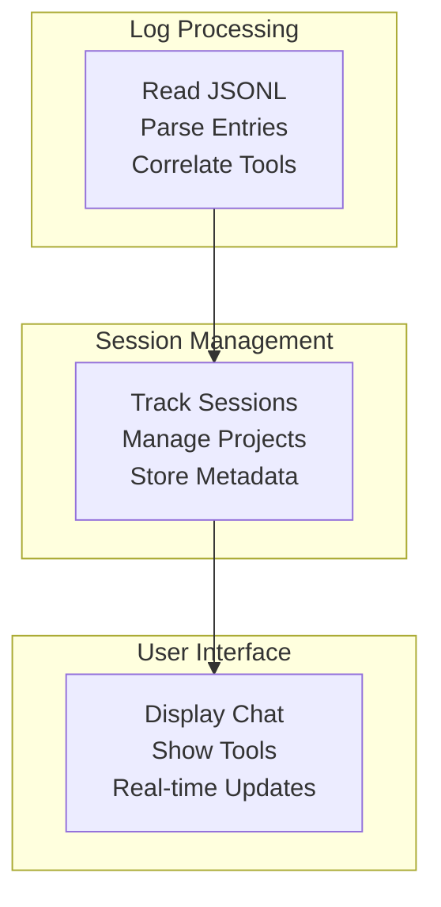

# Final Architecture & Implementation Guide
## Claude Code UI - Complete Specification

This document consolidates all architecture decisions, implementation details, and testing strategies into one comprehensive guide.

---

## 📋 **Table of Contents**
1. [Architecture Overview](#architecture-overview)
2. [Domain Models](#domain-models)
3. [Project Path Handling](#project-path-handling)
4. [Parser Implementations](#parser-implementations)
5. [Testing Strategy](#testing-strategy)
6. [Migration Guide](#migration-guide)
7. [Implementation Checklist](#implementation-checklist)

---

## 🏗️ **Architecture Overview**

### **What We're Building**
A UI wrapper for Claude Code that:
1. **Phase 1**: Reads and visualizes Claude conversation logs (MVP)
2. **Phase 2**: Creates and manages sessions via Claude SDK
3. **Phase 3**: Adds intelligent features (LLM naming, analytics)

### **Core Principles**
- Start simple, add complexity only when needed
- UI components stay in the web app (no separate package)
- Work with Claude's existing log structure
- Test everything that matters

### **Project Structure**
```
claude-ui/
├── apps/
│   ├── web/                    # Next.js frontend
│   │   ├── app/               # App router pages
│   │   ├── components/        # ALL components here
│   │   │   ├── chat-items/   # 14 tool components
│   │   │   │   ├── bash-tool.tsx
│   │   │   │   ├── edit-tool.tsx
│   │   │   │   └── ... (all 14 tools)
│   │   │   └── layout/
│   │   ├── hooks/            # React hooks
│   │   └── lib/              # Utilities
│   │
│   └── api/                   # Elysia API server
│       └── src/
│           ├── routes/       # REST endpoints
│           ├── services/     # Business logic
│           └── ws/           # WebSocket handlers
│
├── packages/
│   ├── core/                  # Domain models
│   │   ├── session/
│   │   ├── project/
│   │   └── chat-items/       # Parsers & types
│   │
│   └── log-processor/         # Log processing
│       ├── monitor/          # File watching
│       └── transformer/      # Correlation engine
│
├── shared/
│   └── types/                # Shared TypeScript types
│
├── biome.json                # Linting/formatting
└── turbo.json               # Monorepo config
```

### **Bounded Contexts**


---

## 🎯 **Domain Models**

### **Core Entities**

```typescript
// shared/types/entities.ts

// Raw data from Claude's JSONL files - WE DON'T CONTROL THIS FORMAT
export interface LogEntry {
  uuid: string;
  parentUuid?: string;
  timestamp: string;
  type: 'user' | 'assistant';
  content: string | MessageContent | MessageContent[];
  isSidechain?: boolean;
}

export interface MessageContent {
  type: 'text' | 'tool_use' | 'tool_result' | 'thinking';
  text?: string;
  id?: string;           // tool_use_id
  name?: string;         // tool name
  input?: unknown;       // tool input
  output?: unknown;      // tool result
  is_error?: boolean;
  tool_use_id?: string;  // for tool_result
}

// Our domain models
export interface Session {
  id: string;                      // From JSONL filename
  projectPath: string;             // Decoded from directory name
  encodedProjectPath: string;      // As stored by Claude
  isActive: boolean;
  lastActivity: Date;
  messageCount: number;
  hasToolUsage: boolean;
  createdAt: Date;
  fileSize: number;
  githubRepo?: GitHubRepo;
}

export interface Project {
  path: string;                    // Real path like /Users/bob/my-project
  encodedPath: string;             // Claude's encoding
  name: string;
  sessionCount: number;
  hasActiveSessions: boolean;
  lastActivity: Date;
  githubRepo?: GitHubRepo;
}

export interface GitHubRepo {
  owner: string;
  repo: string;
  url: string;
}

// UI-ready format
export interface ChatItem {
  id: string;
  type: ChatItemType;
  timestamp: string;
  sessionId: string;
  content: unknown;  // Varies by type
}

export type ChatItemType = 
  | 'user_message' | 'assistant_message' | 'thinking_block'
  | 'bash_tool' | 'edit_tool' | 'read_tool' | 'write_tool'
  | 'glob_tool' | 'grep_tool' | 'ls_tool' | 'multi_edit_tool'
  | 'todo_read_tool' | 'todo_write_tool'
  | 'mcp_sequential_thinking' | 'mcp_context7' | 'mcp_puppeteer';
```

### **Value Objects**

```typescript
// packages/core/project/project-path.ts

export class ProjectPath {
  constructor(
    public readonly encoded: string,    // What Claude gives us
    public readonly decoded: string     // What we figure out
  ) {}
  
  // We can't change how Claude encodes, just decode
  static async resolveFromFileSystem(
    encodedPath: string, 
    logsBaseDir: string
  ): Promise<ProjectPath> {
    // Use file system to resolve ambiguities
    const fullEncodedPath = path.join(logsBaseDir, encodedPath);
    
    // Read the actual .git/config or other markers to determine real path
    const resolved = await this.resolveUsingContext(fullEncodedPath);
    
    return new ProjectPath(encodedPath, resolved);
  }
  
  private static simpleDeccode(encoded: string): string {
    // Basic algorithm - works for most cases
    return '/' + encoded
      .slice(1)                    // Remove leading dash
      .replace(/--/g, '\x00')      // Temporarily replace double dash
      .replace(/-/g, '/')          // Single dash to slash
      .replace(/\x00/g, '.');      // Double dash to dot
  }
}
```

---

## 🗂️ **Project Path Handling**

### **The Problem**
Claude Code generates encoded project paths like:
- `/Users/bob/my-project` → `-Users-bob-my-project`
- `/Users/bob/my.config` → `-Users-bob-my--config`
- `/Users/bob/my-cool-project` → `-Users-bob-my-cool-project` (ambiguous!)

### **The Solution**
Since we can't change Claude's encoding, we use context to resolve:

```typescript
// packages/log-processor/services/project-resolver.ts

export class ProjectResolver {
  constructor(
    private logsDir = path.join(os.homedir(), '.claude/projects')
  ) {}
  
  async resolveProject(encodedPath: string): Promise<Project> {
    const fullPath = path.join(this.logsDir, encodedPath);
    
    // Strategy 1: Check for .git/config
    const gitConfig = await this.tryReadGitConfig(fullPath);
    if (gitConfig) {
      const realPath = await this.extractPathFromGitConfig(gitConfig);
      if (realPath) {
        return this.createProject(encodedPath, realPath);
      }
    }
    
    // Strategy 2: Check for package.json, go.mod, etc.
    const projectMarkers = await this.findProjectMarkers(fullPath);
    if (projectMarkers.length > 0) {
      const realPath = await this.inferFromMarkers(projectMarkers);
      if (realPath) {
        return this.createProject(encodedPath, realPath);
      }
    }
    
    // Strategy 3: Check first log entry for working directory hints
    const firstSession = await this.findFirstSession(fullPath);
    if (firstSession) {
      const hints = await this.extractPathHints(firstSession);
      if (hints) {
        return this.createProject(encodedPath, hints.workingDirectory);
      }
    }
    
    // Fallback: Simple decode
    const decoded = this.simpleDeccode(encodedPath);
    return this.createProject(encodedPath, decoded);
  }
  
  private async tryReadGitConfig(projectDir: string): Promise<string | null> {
    try {
      const configPath = path.join(projectDir, '.git/config');
      return await fs.readFile(configPath, 'utf-8');
    } catch {
      return null;
    }
  }
  
  private async extractPathFromGitConfig(gitConfig: string): Promise<string | null> {
    // Look for worktree or other path indicators
    const worktreeMatch = gitConfig.match(/worktree = (.+)/);
    if (worktreeMatch) {
      return worktreeMatch[1];
    }
    
    // Check remote URL for project name hints
    const urlMatch = gitConfig.match(/url = .+[:/]([^/]+)\/([^.]+)/);
    if (urlMatch) {
      // Can help disambiguate project name
      const [, owner, repo] = urlMatch;
      // Use this info to help resolve path
    }
    
    return null;
  }
}
```

---

## 🔧 **Parser Implementations**

### **Parser Architecture**

```typescript
// packages/core/chat-items/parsers/base.ts

export abstract class BaseToolParser<T extends ChatItem> {
  abstract toolName: string;
  
  canParse(entry: LogEntry): boolean {
    return this.hasToolUse(entry, this.toolName);
  }
  
  protected hasToolUse(entry: LogEntry, toolName: string): boolean {
    if (entry.type !== 'assistant') return false;
    
    const blocks = this.normalizeContent(entry.content);
    return blocks.some(b => b.type === 'tool_use' && b.name === toolName);
  }
  
  protected normalizeContent(content: any): MessageContent[] {
    if (typeof content === 'string') {
      return [{ type: 'text', text: content }];
    }
    if (Array.isArray(content)) return content;
    return [content];
  }
  
  abstract parse(entry: LogEntry, result?: LogEntry): T;
}
```

### **Example Parser: Bash Tool**

```typescript
// packages/core/chat-items/parsers/bash-parser.ts

export class BashToolParser extends BaseToolParser<BashToolItem> {
  toolName = 'bash';
  
  parse(entry: LogEntry, result?: LogEntry): BashToolItem {
    const toolUse = this.extractToolUse(entry);
    const toolResult = result ? this.extractToolResult(result) : null;
    
    return {
      id: toolUse.id,
      type: 'bash_tool',
      timestamp: entry.timestamp,
      sessionId: this.extractSessionId(entry),
      content: {
        command: toolUse.input.command,
        description: toolUse.input.description,
        timeout: toolUse.input.timeout,
        output: toolResult ? {
          stdout: toolResult.output?.stdout || '',
          stderr: toolResult.output?.stderr || '',
          exitCode: toolResult.output?.exit_code || 0,
          isError: toolResult.is_error || false,
          interrupted: toolResult.output?.interrupted || false
        } : undefined,
        status: this.determineStatus(toolResult)
      }
    };
  }
}
```

### **All 14 Parsers**
1. `BashToolParser` - Shell commands
2. `EditToolParser` - File edits
3. `ReadToolParser` - File reading
4. `WriteToolParser` - File writing
5. `GlobToolParser` - File pattern matching
6. `GrepToolParser` - Text search
7. `LsToolParser` - Directory listing
8. `MultiEditToolParser` - Multiple edits
9. `TodoReadToolParser` - Read todo list
10. `TodoWriteToolParser` - Write todo list
11. `McpSequentialThinkingParser` - MCP thinking
12. `McpContext7Parser` - Context lookup
13. `McpPuppeteerParser` - Browser automation
14. `ThinkingBlockParser` - Thinking blocks (not a tool)

---

## 🧪 **Testing Strategy**

### **Test Categories**

| Category | Coverage Target | What to Test |
|----------|----------------|--------------|
| Domain Models | 100% | Business rules, state changes |
| Parsers | 95% | All input/output combinations |
| Correlation | 90% | Tool matching, timeouts |
| Repositories | 85% | Data access, error cases |
| API | 80% | Endpoints, WebSocket |
| UI Components | 70% | User interactions |

### **Domain Model Tests**

```typescript
// tests/unit/domain/session.test.ts

describe('Session', () => {
  describe('activity tracking', () => {
    it('should be active within 60 seconds of last activity', () => {
      const session = new Session({
        id: 'test-123',
        projectPath: '/test/project',
        lastActivity: new Date(),
        messageCount: 5
      });
      
      expect(session.isActive).toBe(true);
    });
    
    it('should be inactive after 60 seconds', () => {
      const oldDate = new Date(Date.now() - 61000);
      const session = new Session({
        id: 'test-123',
        projectPath: '/test/project',
        lastActivity: oldDate,
        messageCount: 5
      });
      
      expect(session.isActive).toBe(false);
    });
  });
});

// No stubs needed - pure domain logic
```

### **Parser Tests**

```typescript
// tests/unit/parsers/bash-parser.test.ts

describe('BashToolParser', () => {
  const parser = new BashToolParser();
  
  it('should parse bash command with all fields', () => {
    const entry = createToolUseEntry('bash', {
      command: 'npm test',
      description: 'Run tests',
      timeout: 30000
    });
    
    const chatItem = parser.parse(entry);
    
    expect(chatItem).toEqual({
      id: expect.any(String),
      type: 'bash_tool',
      timestamp: entry.timestamp,
      sessionId: 'test-session',
      content: {
        command: 'npm test',
        description: 'Run tests',
        timeout: 30000,
        status: 'pending',
        output: undefined
      }
    });
  });
  
  it('should parse error results', () => {
    const call = createToolUseEntry('bash', { command: 'false' });
    const result = createToolResultEntry(call.content[0].id, {
      stdout: '',
      stderr: 'Command failed',
      exit_code: 1
    }, true);
    
    const chatItem = parser.parse(call, result);
    
    expect(chatItem.content.status).toBe('failed');
    expect(chatItem.content.output.isError).toBe(true);
  });
});

// Test utilities
function createToolUseEntry(tool: string, input: any): LogEntry {
  return {
    uuid: `msg-${Date.now()}`,
    timestamp: new Date().toISOString(),
    type: 'assistant',
    content: [{
      type: 'tool_use',
      id: `${tool}-${Date.now()}`,
      name: tool,
      input
    }]
  };
}
```

### **Integration Tests**

```typescript
// tests/integration/correlation-engine.test.ts

describe('CorrelationEngine', () => {
  let engine: CorrelationEngine;
  let mockEmitter: MockEventEmitter;
  
  beforeEach(() => {
    mockEmitter = new MockEventEmitter();
    engine = new CorrelationEngine(new ParserRegistry(), mockEmitter);
  });
  
  it('should correlate tool call with result', async () => {
    const call = createToolUseEntry('bash', { command: 'echo hi' });
    const result = createToolResultEntry(call.content[0].id, {
      stdout: 'hi\n'
    });
    
    await engine.processEntry(call);
    const chatItem = await engine.processEntry(result);
    
    expect(chatItem.content.status).toBe('completed');
    expect(chatItem.content.output.stdout).toBe('hi\n');
    
    expect(mockEmitter.events).toContainEqual({
      name: 'tool.completed',
      data: expect.objectContaining({
        toolName: 'bash',
        duration: expect.any(Number)
      })
    });
  });
  
  it('should timeout orphaned calls after 5 minutes', () => {
    jest.useFakeTimers();
    
    const call = createToolUseEntry('bash', { command: 'sleep 999' });
    engine.processEntry(call);
    
    jest.advanceTimersByTime(5 * 60 * 1000 + 1);
    
    expect(mockEmitter.events).toContainEqual({
      name: 'tool.timeout',
      data: expect.objectContaining({ toolName: 'bash' })
    });
  });
});

// Stub
class MockEventEmitter {
  events: Array<{name: string, data: any}> = [];
  
  emit(name: string, data: any) {
    this.events.push({ name, data });
  }
}
```

### **Repository Tests**

```typescript
// tests/integration/file-session-repository.test.ts

describe('FileSessionRepository', () => {
  let repo: FileSessionRepository;
  let mockFS: MockFileSystem;
  
  beforeEach(() => {
    mockFS = new MockFileSystem();
    repo = new FileSessionRepository(mockFS);
  });
  
  it('should load session from JSONL file', async () => {
    mockFS.addFile(
      '/home/user/.claude/projects/-test-project/abc-123.jsonl',
      [
        '{"uuid":"1","type":"user","content":"Hello"}',
        '{"uuid":"2","type":"assistant","content":"Hi there"}'
      ].join('\n')
    );
    
    const session = await repo.findById('abc-123');
    
    expect(session).toBeDefined();
    expect(session.messageCount).toBe(2);
    expect(session.projectPath).toBe('/test/project');
  });
});

// Stub
class MockFileSystem {
  files = new Map<string, string>();
  
  addFile(path: string, content: string) {
    this.files.set(path, content);
  }
  
  async readFile(path: string): Promise<string> {
    if (!this.files.has(path)) {
      throw new Error(`ENOENT: ${path}`);
    }
    return this.files.get(path)!;
  }
  
  async exists(path: string): Promise<boolean> {
    return this.files.has(path);
  }
  
  async readdir(path: string): Promise<string[]> {
    // Return files in directory
  }
}
```

---

## 🔄 **Migration Guide**

### **What to Keep from Current Codebase**

```typescript
// KEEP THESE - They work well
1. packages/api-server/src/types/api.ts      → shared/types/api.ts
2. packages/codex-log-monitor/src/monitor.ts → packages/log-processor/monitor/
3. packages/transformer/src/correlation-engine.ts → (simplified)
4. packages/client/hooks/use-sessions.ts    → apps/web/hooks/

// REFACTOR THESE
1. Consolidate 15 chat-item packages → packages/core/chat-items/
2. Simplify transformer logic
3. Remove fixture-based generation

// DISCARD THESE
1. Complex tool registration system
2. Fixture generation pipeline
3. ui-components package structure
4. Multiple validation layers
```

### **Step-by-Step Migration**

```bash
# Week 1: Foundation
Day 1-2: Create new project structure
Day 3-4: Copy types and domain models
Day 5: Set up build system with Turborepo

# Week 2: Core Implementation  
Day 1-2: Implement all 14 parsers
Day 3: Port correlation engine
Day 4: Create repositories
Day 5: API routes

# Week 3: UI & Polish
Day 1-2: Create React components
Day 3: WebSocket integration
Day 4: Testing
Day 5: Documentation
```

---

## ✅ **Implementation Checklist**

### **Foundation (Days 1-3)**
- [ ] Create new monorepo with Turborepo
- [ ] Set up Next.js 14 with App Router
- [ ] Configure TypeScript and Biome
- [ ] Create folder structure
- [ ] Install dependencies

### **Domain Layer (Days 4-6)**
- [ ] Define all TypeScript types
- [ ] Create Session entity
- [ ] Create Project entity
- [ ] Implement ProjectPath resolver
- [ ] Add GitHub detection

### **Parsers (Days 7-9)**
- [ ] Create base parser class
- [ ] Implement BashToolParser
- [ ] Implement EditToolParser
- [ ] Implement ReadToolParser
- [ ] ... (all 14 parsers)

### **Processing (Days 10-12)**
- [ ] Port FileMonitor
- [ ] Create CorrelationEngine
- [ ] Implement SessionScanner
- [ ] Add ProjectResolver

### **API (Days 13-15)**
- [ ] Set up Elysia server
- [ ] Create session routes
- [ ] Create project routes
- [ ] Add WebSocket endpoint
- [ ] Error handling

### **UI (Days 16-18)**
- [ ] Create layout components
- [ ] Build chat item components
- [ ] Add React Query hooks
- [ ] WebSocket client
- [ ] Loading/error states

### **Testing (Days 19-21)**
- [ ] Unit tests for parsers
- [ ] Integration tests
- [ ] E2E test setup
- [ ] Performance testing
- [ ] Documentation

---

## 🎯 **Key Decisions Summary**

1. **UI components stay in web app** - Simpler imports
2. **Work with Claude's path encoding** - Use context to resolve
3. **Repository pattern** - For data access flexibility
4. **Biome over ESLint** - Modern, faster
5. **Simple architecture** - 3 contexts, not 5+
6. **Comprehensive testing** - Specific examples provided

This is your complete implementation guide. Everything else can be archived.