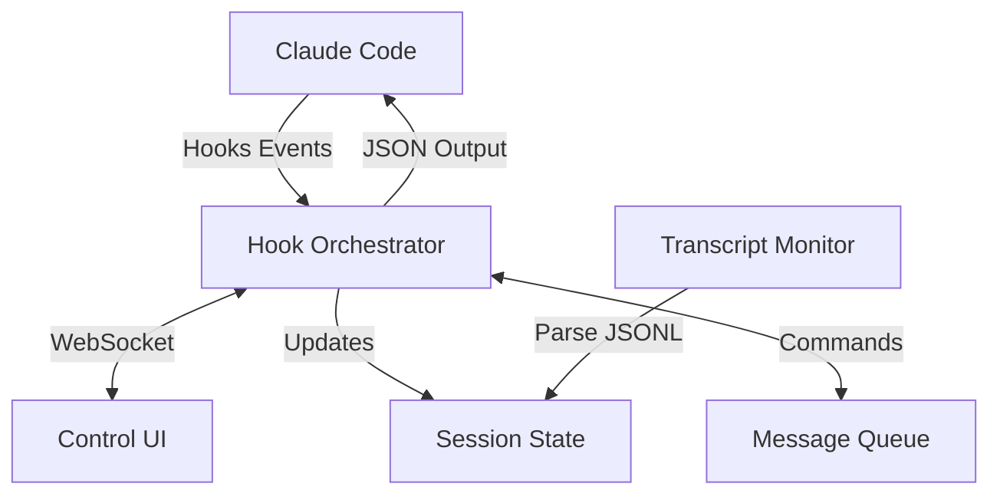

# Claude Code Control System Architecture

## Overview

This document outlines the architecture for building an advanced power user environment that provides real-time monitoring, control, and enhancement capabilities for Claude Code sessions using the newly released hooks system.

## Core Architecture Components

### 1. Real-time Session Control

The session control system enables bidirectional communication with Claude Code during execution.



#### Key Components:

- **Hook Orchestrator**: Central coordinator for all hook events
- **Session State Manager**: Maintains real-time session state from transcript parsing
- **Message Queue**: Enables message injection without stopping execution
- **WebSocket Bridge**: Real-time UI communication

### 2. Hook Configuration Strategy

```json
{
  "hooks": {
    "Stop": [{
      "matcher": "",
      "hooks": [{
        "type": "command",
        "command": "python3 ~/claude-control/orchestrator.py --event stop"
      }]
    }],
    "PreToolUse": [{
      "matcher": ".*",
      "hooks": [{
        "type": "command",
        "command": "python3 ~/claude-control/orchestrator.py --event pre-tool"
      }]
    }],
    "PostToolUse": [{
      "matcher": ".*",
      "hooks": [{
        "type": "command",
        "command": "python3 ~/claude-control/orchestrator.py --event post-tool"
      }]
    }]
  }
}
```

### 3. Message Injection System

Enable seamless message injection without interrupting Claude's flow:

```python
# Stop hook handler for message injection
def handle_stop_hook(event_data):
    session_id = event_data['session_id']
    
    # Check message queue
    if pending_message := message_queue.get(session_id):
        return {
            "decision": "block",
            "reason": pending_message,
            "suppressOutput": True
        }
    
    # Allow normal stop
    return {"continue": True}
```

### 4. Directory Access Control

Implement granular file system access control:

```python
class DirectoryAccessController:
    def __init__(self, config_path):
        self.config = self.load_config(config_path)
        
    def check_access(self, tool_name, tool_input):
        if tool_name not in ['Read', 'Write', 'Edit', 'MultiEdit']:
            return None
            
        file_path = tool_input.get('file_path', '')
        
        # Check blocked directories
        for blocked in self.config['blocked_dirs']:
            if file_path.startswith(blocked):
                return {
                    "decision": "block",
                    "reason": f"Access denied: {blocked} is protected"
                }
        
        # Check allowed directories
        if self.config.get('restrict_to_allowed', False):
            if not any(file_path.startswith(allowed) 
                      for allowed in self.config['allowed_dirs']):
                return {
                    "decision": "block",
                    "reason": "File outside allowed directories"
                }
        
        return {"decision": "approve"}
```

### 5. Session State Reconstruction

Real-time session state tracking from transcript:

```python
class SessionStateManager:
    def __init__(self, transcript_path):
        self.transcript_path = transcript_path
        self.state = {
            'files_modified': set(),
            'commands_executed': [],
            'current_context': [],
            'tool_calls': []
        }
        self.monitor_transcript()
    
    def parse_transcript_line(self, line):
        entry = json.loads(line)
        
        if entry['type'] == 'tool_use':
            self.track_tool_use(entry)
        elif entry['type'] == 'text':
            self.track_message(entry)
    
    def create_snapshot(self):
        return {
            'timestamp': datetime.now().isoformat(),
            'state': copy.deepcopy(self.state),
            'position': self.transcript_position
        }
```

### 6. WebSocket Communication Layer

Real-time bidirectional communication:

```typescript
// Frontend WebSocket client
class ClaudeControlClient {
  private ws: WebSocket;
  private sessionId: string;
  
  connect(sessionId: string) {
    this.ws = new WebSocket('ws://localhost:8765');
    this.sessionId = sessionId;
    
    this.ws.on('message', (data) => {
      const event = JSON.parse(data);
      this.handleEvent(event);
    });
  }
  
  // Control methods
  async injectMessage(message: string) {
    this.ws.send(JSON.stringify({
      type: 'inject_message',
      sessionId: this.sessionId,
      message
    }));
  }
  
  async modifyToolCall(toolCallId: string, changes: any) {
    this.ws.send(JSON.stringify({
      type: 'modify_tool',
      sessionId: this.sessionId,
      toolCallId,
      changes
    }));
  }
}
```

## Advanced Features

### 1. Execution Policies

Define declarative policies for tool execution:

```yaml
policies:
  - name: "Rate limit expensive operations"
    match:
      tools: ["WebSearch", "WebFetch"]
    conditions:
      - max_calls_per_minute: 10
    action: "block"
    message: "Rate limit exceeded for web operations"
    
  - name: "Staging area for writes"
    match:
      tools: ["Write", "MultiEdit"]
      path_pattern: "*/production/*"
    action: "redirect"
    redirect_to: "/tmp/staging/"
```

### 2. Smart Tool Routing

Route tools through custom handlers:

```python
class ToolRouter:
    def __init__(self):
        self.routes = {}
        
    def route_web_search(self, original_input):
        # Route through custom search aggregator
        return {
            "tool": "mcp__custom_search__aggregate",
            "input": {
                "query": original_input["query"],
                "providers": ["google", "perplexity", "custom"]
            }
        }
    
    def route_file_write(self, original_input):
        # Add automatic backups
        backup_path = f"{original_input['file_path']}.backup"
        self.create_backup(original_input['file_path'], backup_path)
        return original_input
```

### 3. Context Injection System

Dynamically inject context based on current task:

```python
class ContextInjector:
    def inject_for_task(self, session_state):
        current_files = session_state['files_modified']
        
        # Analyze current context
        if any('test' in f for f in current_files):
            return "Remember to run tests after modifications"
        
        if any('.sql' in f for f in current_files):
            return "Validate SQL syntax and consider migration impact"
        
        return None
```

### 4. Collaboration Features

Enable multi-user session sharing:

```python
class CollaborationManager:
    def __init__(self):
        self.shared_sessions = {}
        
    def share_session(self, session_id, permissions):
        share_token = self.generate_token()
        self.shared_sessions[share_token] = {
            'session_id': session_id,
            'permissions': permissions,
            'viewers': []
        }
        return share_token
    
    def handle_viewer_action(self, token, action):
        session = self.shared_sessions[token]
        if action['type'] in session['permissions']:
            self.forward_to_session(session['session_id'], action)
```

## Implementation Roadmap

### Phase 1: Core Infrastructure (Week 1-2)
1. Set up hook orchestrator
2. Implement transcript monitoring
3. Create WebSocket server
4. Build message injection system

### Phase 2: Control Features (Week 3-4)
1. Directory access control
2. Tool routing system
3. Basic UI for monitoring
4. Session state snapshots

### Phase 3: Advanced Features (Week 5-6)
1. Policy engine
2. Context injection
3. Collaboration system
4. Advanced UI controls

### Phase 4: Power User Features (Week 7-8)
1. Session replay
2. Time-travel debugging
3. Automated testing integration
4. Performance analytics

## Security Considerations

1. **Hook Validation**: All hooks must validate input thoroughly
2. **Access Control**: Implement role-based permissions for control features
3. **Audit Logging**: Log all control actions for compliance
4. **Sandboxing**: Option to run Claude in restricted environments
5. **Secret Protection**: Never log sensitive information

## Performance Optimization

1. **Efficient Transcript Parsing**: Use streaming JSON parser
2. **Message Queue**: Implement with Redis for scalability
3. **State Caching**: Cache frequently accessed state
4. **WebSocket Compression**: Enable compression for real-time data
5. **Hook Timeout Management**: Ensure hooks complete within limits

## Integration with Existing Claude Codex

The control system integrates with Claude Codex by:

1. **Extended Log Processing**: Enhance log processor to handle control events
2. **UI Components**: Build control UI components in the web app
3. **API Extensions**: Add control endpoints to API server
4. **Real-time Updates**: Use WebSocket for live session monitoring

## Conclusion

This architecture provides a comprehensive foundation for building an advanced Claude Code control system. It enables real-time monitoring, message injection, execution control, and collaboration while maintaining security and performance.

The modular design allows incremental implementation and easy extension with new features as requirements evolve.