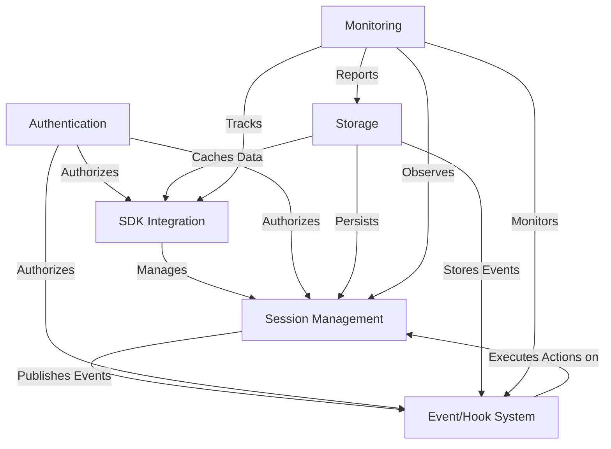

# Claude Session Domains - DDD Architecture Design

## Current Architecture Analysis ✅

**Existing Claude Codex Foundation:**
- **Log Parser System**: Hybrid schema architecture with UI-ready props
- **API Server**: Session scanning, history reading, RESTful endpoints  
- **Client Framework**: React hooks, session management, real-time updates
- **Type System**: Authoritative schema following SOT document
- **Monitoring**: File system monitoring, correlation engine

---

## Bounded Contexts Identification ✅

**Six Strategic Domains Identified:**

1. **📋 Session Management** - Core session lifecycle & operations
2. **🔌 SDK Integration** - External APIs & third-party connectors  
3. **⚡ Event/Hook System** - Event-driven patterns & automations
4. **🔐 Authentication** - Security, permissions & access control
5. **💾 Storage** - Data persistence & retrieval strategies
6. **📊 Monitoring** - Observability, health & performance tracking

---

## Domain 1: Session Management Context

### Core Entities & Aggregates

```typescript
// Session Aggregate Root
export class Session {
  private constructor(
    private readonly id: SessionId,
    private readonly projectContext: ProjectContext,
    private state: SessionState,
    private readonly history: ConversationHistory,
    private readonly metadata: SessionMetadata
  ) {}

  // Factory methods
  static create(projectPath: string, userId?: UserId): Session
  static fromLogFile(filePath: string): Session
  static restore(sessionData: SessionSnapshot): Session

  // Core domain methods
  addMessage(message: Message): void
  addToolExecution(toolCall: ToolCall, result?: ToolResult): void
  updateActivity(): void
  markAsActive(): void
  markAsInactive(): void
  
  // Query methods
  getRecentActivity(window: TimeWindow): Activity[]
  getToolUsage(): ToolUsageStats
  calculateMetrics(): SessionMetrics
  
  // Domain events
  publishEvent(event: SessionDomainEvent): void
}

// Value Objects
export class SessionId {
  constructor(private readonly value: string) {
    if (!this.isValidUUID(value)) {
      throw new SessionIdInvalidError(value)
    }
  }
  
  toString(): string { return this.value }
  equals(other: SessionId): boolean { return this.value === other.value }
  
  private isValidUUID(value: string): boolean {
    return /^[0-9a-f]{8}-[0-9a-f]{4}-[0-9a-f]{4}-[0-9a-f]{4}-[0-9a-f]{12}$/i.test(value)
  }
}

export class ProjectContext {
  constructor(
    private readonly path: ProjectPath,
    private readonly name: ProjectName,
    private readonly workspace?: WorkspaceConfig
  ) {}
  
  isWithinWorkspace(path: string): boolean
  resolveRelativePath(relativePath: string): string
  getProjectMetadata(): ProjectMetadata
}

export class ConversationHistory {
  private messages: Message[] = []
  private toolExecutions: ToolExecution[] = []
  
  addMessage(message: Message): void
  addToolExecution(execution: ToolExecution): void
  getMessagesSince(timestamp: Timestamp): Message[]
  getToolExecutionsSince(timestamp: Timestamp): ToolExecution[]
  
  // Correlation methods
  correlateCalls(): CorrelatedExecution[]
  findOrphanedCalls(): ToolCall[]
  validateIntegrity(): ValidationResult
}

// Domain Entities
export class Message {
  constructor(
    private readonly id: MessageId,
    private readonly type: MessageType,
    private readonly content: MessageContent,
    private readonly timestamp: Timestamp,
    private readonly parentId?: MessageId
  ) {}
  
  isUserMessage(): boolean
  isAssistantMessage(): boolean
  containsToolCalls(): boolean
  getToolCalls(): ToolCall[]
}

export class ToolExecution {
  constructor(
    private readonly id: ExecutionId,
    private readonly toolCall: ToolCall,
    private result?: ToolResult,
    private readonly status: ExecutionStatus
  ) {}
  
  complete(result: ToolResult): void
  fail(error: ExecutionError): void
  isSuccessful(): boolean
  getDuration(): Duration
  getCorrelationId(): string
}
```

### Domain Services

```typescript
// Session Discovery Service
export class SessionDiscoveryService {
  constructor(
    private readonly fileSystemMonitor: FileSystemMonitor,
    private readonly sessionRepository: SessionRepository,
    private readonly projectResolver: ProjectResolver
  ) {}
  
  async discoverSessions(options: DiscoveryOptions): Promise<Session[]>
  async scanForNewSessions(): Promise<Session[]>
  async monitorActiveSession(sessionId: SessionId): Promise<void>
  
  private async validateSessionFile(filePath: string): Promise<boolean>
  private async parseSessionFromFile(filePath: string): Promise<Session>
}

// Session Lifecycle Service
export class SessionLifecycleService {
  constructor(
    private readonly sessionRepository: SessionRepository,
    private readonly eventPublisher: DomainEventPublisher
  ) {}
  
  async createSession(command: CreateSessionCommand): Promise<Session>
  async activateSession(sessionId: SessionId): Promise<void>
  async deactivateSession(sessionId: SessionId): Promise<void>
  async archiveSession(sessionId: SessionId): Promise<void>
  
  private async publishSessionEvent(event: SessionDomainEvent): Promise<void>
}

// Session Correlation Service
export class SessionCorrelationService {
  async correlateToolExecutions(session: Session): Promise<CorrelationResult>
  async validateSessionIntegrity(session: Session): Promise<ValidationResult>
  async repairCorruptions(session: Session): Promise<RepairResult>
  
  private async correlateByUUID(executions: ToolExecution[]): Promise<Map<string, ToolExecution[]>>
  private async correlateByTimestamp(executions: ToolExecution[]): Promise<CorrelatedGroup[]>
}
```

### Repository Patterns

```typescript
export interface SessionRepository {
  // Core CRUD operations
  save(session: Session): Promise<void>
  findById(id: SessionId): Promise<Session | null>
  findByProject(projectPath: string): Promise<Session[]>
  findActive(): Promise<Session[]>
  
  // Query operations
  findSessionsWithToolUsage(): Promise<Session[]>
  findSessionsByTimeRange(range: TimeRange): Promise<Session[]>
  findSessionsByUser(userId: UserId): Promise<Session[]>
  
  // Bulk operations
  saveAll(sessions: Session[]): Promise<void>
  deleteExpiredSessions(cutoff: Timestamp): Promise<number>
  
  // Stream operations for large datasets
  streamActiveSessions(): AsyncIterable<Session>
  streamByProject(projectPath: string): AsyncIterable<Session>
}

export interface ConversationRepository {
  saveHistory(sessionId: SessionId, history: ConversationHistory): Promise<void>
  loadHistory(sessionId: SessionId, options?: HistoryOptions): Promise<ConversationHistory>
  appendMessage(sessionId: SessionId, message: Message): Promise<void>
  appendToolExecution(sessionId: SessionId, execution: ToolExecution): Promise<void>
  
  // Streaming for real-time updates
  watchHistory(sessionId: SessionId): AsyncIterable<HistoryChange>
}
```

## Domain 2: SDK Integration Context

### Core Abstractions & Patterns

```typescript
// SDK Aggregate Root
export class ClaudeSDK {
  private constructor(
    private readonly config: SDKConfiguration,
    private readonly sessionManager: SessionManager,
    private readonly connectorRegistry: ConnectorRegistry,
    private readonly middlewareChain: MiddlewareChain
  ) {}
  
  static builder(): SDKBuilder
  
  // Core SDK Operations
  async createSession(options: SessionCreationOptions): Promise<SessionHandle>
  async connectToSession(sessionId: SessionId): Promise<SessionHandle>
  async listSessions(filter?: SessionFilter): Promise<SessionSummary[]>
  
  // Connector Management
  registerConnector<T extends Connector>(connector: T): this
  unregisterConnector(connectorType: ConnectorType): this
  getConnector<T extends Connector>(type: ConnectorType): T | null
  
  // Middleware Support
  use(middleware: SDKMiddleware): this
  removeMiddleware(middleware: SDKMiddleware): this
}

// Session Handle - External API
export class SessionHandle {
  constructor(
    private readonly session: Session,
    private readonly sdk: ClaudeSDK,
    private readonly eventStream: EventStream
  ) {}
  
  // Read Operations
  getId(): string
  getProject(): ProjectInfo
  getMetadata(): SessionMetadata
  getStatus(): SessionStatus
  
  // Real-time Operations
  streamMessages(): AsyncIterable<Message>
  streamToolExecutions(): AsyncIterable<ToolExecution>
  streamEvents(): AsyncIterable<SessionEvent>
  
  // Query Operations  
  async getHistory(options?: HistoryQueryOptions): Promise<ConversationHistory>
  async getRecentActivity(window?: TimeWindow): Promise<Activity[]>
  async getToolUsage(): Promise<ToolUsageStats>
  
  // Control Operations
  async activate(): Promise<void>
  async deactivate(): Promise<void>
  async archive(): Promise<void>
  
  // Event Registration
  on(eventType: SessionEventType, handler: EventHandler): this
  off(eventType: SessionEventType, handler: EventHandler): this
  once(eventType: SessionEventType, handler: EventHandler): this
}

// Connector Pattern for Extensions
export abstract class Connector {
  abstract readonly type: ConnectorType
  abstract readonly version: string
  
  abstract initialize(config: ConnectorConfig): Promise<void>
  abstract shutdown(): Promise<void>
  abstract healthCheck(): Promise<ConnectorHealth>
  
  // Extension points
  protected abstract onSessionCreated(session: Session): Promise<void>
  protected abstract onSessionUpdated(session: Session): Promise<void>
  protected abstract onToolExecuted(execution: ToolExecution): Promise<void>
}

// Built-in Connectors
export class WebSocketConnector extends Connector {
  readonly type = ConnectorType.WEBSOCKET
  readonly version = "1.0.0"
  
  async initialize(config: WebSocketConfig): Promise<void>
  async broadcastSessionUpdate(sessionId: SessionId, update: SessionUpdate): Promise<void>
  async subscribeToSession(sessionId: SessionId, client: WebSocketClient): Promise<void>
  
  protected async onSessionCreated(session: Session): Promise<void>
  protected async onSessionUpdated(session: Session): Promise<void>
  protected async onToolExecuted(execution: ToolExecution): Promise<void>
}

export class DatabaseConnector extends Connector {
  readonly type = ConnectorType.DATABASE
  readonly version = "1.0.0"
  
  async initialize(config: DatabaseConfig): Promise<void>
  async persistSession(session: Session): Promise<void>
  async queryActiveSessions(): Promise<Session[]>
  
  protected async onSessionCreated(session: Session): Promise<void>
  protected async onSessionUpdated(session: Session): Promise<void>
  protected async onToolExecuted(execution: ToolExecution): Promise<void>
}

export class MetricsConnector extends Connector {
  readonly type = ConnectorType.METRICS
  readonly version = "1.0.0"
  
  async initialize(config: MetricsConfig): Promise<void>
  async recordMetric(metric: SessionMetric): Promise<void>
  async recordToolUsage(toolUsage: ToolUsageMetric): Promise<void>
  
  protected async onSessionCreated(session: Session): Promise<void>
  protected async onSessionUpdated(session: Session): Promise<void>
  protected async onToolExecuted(execution: ToolExecution): Promise<void>
}
```

### SDK Builder Pattern

```typescript
export class SDKBuilder {
  private config: Partial<SDKConfiguration> = {}
  private connectors: Connector[] = []
  private middlewares: SDKMiddleware[] = []
  
  // Configuration
  withConfig(config: Partial<SDKConfiguration>): this
  withLogsPath(path: string): this
  withCacheSize(size: number): this
  
  // Connector Registration
  withWebSocket(config: WebSocketConfig): this
  withDatabase(config: DatabaseConfig): this
  withMetrics(config: MetricsConfig): this
  withCustomConnector(connector: Connector): this
  
  // Middleware Registration
  withMiddleware(middleware: SDKMiddleware): this
  withLogging(config: LoggingConfig): this
  withRetry(config: RetryConfig): this
  withRateLimit(config: RateLimitConfig): this
  
  // Build
  async build(): Promise<ClaudeSDK>
  
  private validateConfiguration(): void
  private initializeConnectors(): Promise<void>
  private setupMiddlewareChain(): MiddlewareChain
}

// Middleware Pattern
export abstract class SDKMiddleware {
  abstract name: string
  abstract priority: number
  
  abstract beforeRequest(context: RequestContext): Promise<RequestContext>
  abstract afterResponse(context: ResponseContext): Promise<ResponseContext>
  abstract onError(error: SDKError, context: ErrorContext): Promise<ErrorContext>
}

export class LoggingMiddleware extends SDKMiddleware {
  name = "logging"
  priority = 100
  
  async beforeRequest(context: RequestContext): Promise<RequestContext>
  async afterResponse(context: ResponseContext): Promise<ResponseContext>
  async onError(error: SDKError, context: ErrorContext): Promise<ErrorContext>
}

export class RetryMiddleware extends SDKMiddleware {
  name = "retry"
  priority = 200
  
  constructor(private config: RetryConfig) { super() }
  
  async beforeRequest(context: RequestContext): Promise<RequestContext>
  async afterResponse(context: ResponseContext): Promise<ResponseContext>
  async onError(error: SDKError, context: ErrorContext): Promise<ErrorContext>
}
```

### Integration Services

```typescript
// Integration Service for External APIs
export class ExternalIntegrationService {
  constructor(
    private readonly httpClient: HttpClient,
    private readonly authProvider: AuthenticationProvider,
    private readonly rateLimiter: RateLimiter
  ) {}
  
  // Generic API Integration
  async registerWebhook(endpoint: WebhookEndpoint): Promise<WebhookRegistration>
  async sendSessionUpdate(integration: Integration, update: SessionUpdate): Promise<void>
  async syncWithExternal(integration: Integration, session: Session): Promise<SyncResult>
  
  // Specific Integrations
  async integrateWithSlack(config: SlackConfig): Promise<SlackIntegration>
  async integrateWithDiscord(config: DiscordConfig): Promise<DiscordIntegration>
  async integrateWithGitHub(config: GitHubConfig): Promise<GitHubIntegration>
  async integrateWithJira(config: JiraConfig): Promise<JiraIntegration>
}

// Plugin System
export class PluginManager {
  private plugins: Map<string, Plugin> = new Map()
  
  async loadPlugin(pluginPath: string): Promise<void>
  async unloadPlugin(pluginName: string): Promise<void>
  async reloadPlugin(pluginName: string): Promise<void>
  
  getPlugin<T extends Plugin>(name: string): T | null
  listPlugins(): PluginInfo[]
  
  // Plugin lifecycle
  private async validatePlugin(plugin: Plugin): Promise<ValidationResult>
  private async initializePlugin(plugin: Plugin): Promise<void>
  private async shutdownPlugin(plugin: Plugin): Promise<void>
}

export abstract class Plugin {
  abstract readonly name: string
  abstract readonly version: string
  abstract readonly dependencies: string[]
  
  abstract initialize(sdk: ClaudeSDK): Promise<void>
  abstract shutdown(): Promise<void>
  
  // Optional hooks
  onSessionCreated?(session: Session): Promise<void>
  onSessionUpdated?(session: Session): Promise<void>
  onToolExecuted?(execution: ToolExecution): Promise<void>
}
```

## Domain 3: Event/Hook System Context

### Core Event Architecture

```typescript
// Hook Aggregate Root
export class Hook {
  private constructor(
    private readonly id: HookId,
    private readonly definition: HookDefinition,
    private state: HookState,
    private readonly executionHistory: ExecutionHistory
  ) {}
  
  static create(definition: HookDefinition): Hook
  static fromConfig(config: HookConfiguration): Hook
  
  // Core Operations
  async execute(event: DomainEvent, context: ExecutionContext): Promise<ExecutionResult>
  enable(): void
  disable(): void
  suspend(): void
  resume(): void
  
  // Query Methods
  isEnabled(): boolean
  canExecute(event: DomainEvent): boolean
  getLastExecution(): ExecutionRecord | null
  getExecutionStats(): ExecutionStats
}

// Hook Definition Value Object
export class HookDefinition {
  constructor(
    private readonly trigger: EventTrigger,
    private readonly conditions: ExecutionCondition[],
    private readonly actions: HookAction[],
    private readonly metadata: HookMetadata
  ) {}
  
  matches(event: DomainEvent): boolean
  validateActions(): ValidationResult
  getExecutionPlan(): ExecutionPlan
}

// Event System
export abstract class DomainEvent {
  constructor(
    public readonly id: EventId,
    public readonly timestamp: Timestamp,
    public readonly source: EventSource,
    public readonly metadata: EventMetadata
  ) {}
  
  abstract getEventType(): EventType
  abstract getPayload(): unknown
}

// Specific Session Events
export class SessionCreatedEvent extends DomainEvent {
  constructor(
    id: EventId,
    timestamp: Timestamp,
    public readonly session: Session
  ) {
    super(id, timestamp, EventSource.SESSION_MANAGER, {})
  }
  
  getEventType(): EventType { return EventType.SESSION_CREATED }
  getPayload(): SessionCreatedPayload { return { sessionId: this.session.getId() } }
}

export class ToolExecutedEvent extends DomainEvent {
  constructor(
    id: EventId,
    timestamp: Timestamp,
    public readonly execution: ToolExecution,
    public readonly session: Session
  ) {
    super(id, timestamp, EventSource.TOOL_EXECUTOR, {})
  }
  
  getEventType(): EventType { return EventType.TOOL_EXECUTED }
  getPayload(): ToolExecutedPayload {
    return {
      sessionId: this.session.getId(),
      toolType: this.execution.getToolType(),
      executionId: this.execution.getId(),
      success: this.execution.isSuccessful()
    }
  }
}

export class SessionActivityEvent extends DomainEvent {
  constructor(
    id: EventId,
    timestamp: Timestamp,
    public readonly sessionId: SessionId,
    public readonly activityType: ActivityType
  ) {
    super(id, timestamp, EventSource.SESSION_MONITOR, {})
  }
  
  getEventType(): EventType { return EventType.SESSION_ACTIVITY }
  getPayload(): SessionActivityPayload {
    return {
      sessionId: this.sessionId.toString(),
      activityType: this.activityType
    }
  }
}
```

### Hook Action System

```typescript
// Abstract Hook Action
export abstract class HookAction {
  constructor(
    protected readonly config: ActionConfig,
    protected readonly retryPolicy: RetryPolicy
  ) {}
  
  abstract execute(context: ExecutionContext): Promise<ActionResult>
  abstract validate(): ValidationResult
  abstract getActionType(): ActionType
  
  // Common execution logic
  async executeWithRetry(context: ExecutionContext): Promise<ActionResult> {
    let lastError: Error | null = null
    
    for (let attempt = 0; attempt < this.retryPolicy.maxAttempts; attempt++) {
      try {
        return await this.execute(context)
      } catch (error) {
        lastError = error as Error
        if (attempt < this.retryPolicy.maxAttempts - 1) {
          await this.delay(this.retryPolicy.backoffMs * Math.pow(2, attempt))
        }
      }
    }
    
    throw new ActionExecutionError(lastError?.message || 'Unknown error')
  }
  
  private delay(ms: number): Promise<void> {
    return new Promise(resolve => setTimeout(resolve, ms))
  }
}

// Built-in Actions
export class NotificationAction extends HookAction {
  getActionType(): ActionType { return ActionType.NOTIFICATION }
  
  async execute(context: ExecutionContext): Promise<ActionResult> {
    const notificationConfig = this.config as NotificationConfig
    const message = this.interpolateMessage(notificationConfig.template, context)
    
    switch (notificationConfig.channel) {
      case 'slack':
        return await this.sendSlackMessage(message, notificationConfig.slackConfig)
      case 'email':
        return await this.sendEmail(message, notificationConfig.emailConfig)
      case 'webhook':
        return await this.sendWebhook(message, notificationConfig.webhookConfig)
      default:
        throw new UnsupportedChannelError(notificationConfig.channel)
    }
  }
  
  validate(): ValidationResult {
    // Validate notification configuration
  }
  
  private interpolateMessage(template: string, context: ExecutionContext): string {
    // Template interpolation logic
  }
}

export class FileAction extends HookAction {
  getActionType(): ActionType { return ActionType.FILE_OPERATION }
  
  async execute(context: ExecutionContext): Promise<ActionResult> {
    const fileConfig = this.config as FileActionConfig
    
    switch (fileConfig.operation) {
      case 'create':
        return await this.createFile(fileConfig, context)
      case 'append':
        return await this.appendToFile(fileConfig, context)
      case 'backup':
        return await this.backupSession(fileConfig, context)
      default:
        throw new UnsupportedOperationError(fileConfig.operation)
    }
  }
  
  validate(): ValidationResult {
    // Validate file operation configuration
  }
}

export class ScriptAction extends HookAction {
  getActionType(): ActionType { return ActionType.SCRIPT_EXECUTION }
  
  async execute(context: ExecutionContext): Promise<ActionResult> {
    const scriptConfig = this.config as ScriptActionConfig
    
    // Security validation
    if (!this.isScriptSafe(scriptConfig.script)) {
      throw new UnsafeScriptError('Script contains potentially dangerous operations')
    }
    
    // Execute in sandboxed environment
    return await this.executeScript(scriptConfig.script, context)
  }
  
  validate(): ValidationResult {
    // Validate script safety and syntax
  }
  
  private isScriptSafe(script: string): boolean {
    // Security checks for script content
  }
}
```

### Event Processing Engine

```typescript
export class EventProcessingEngine {
  constructor(
    private readonly hookRegistry: HookRegistry,
    private readonly executorService: HookExecutorService,
    private readonly eventStore: EventStore
  ) {}
  
  async processEvent(event: DomainEvent): Promise<ProcessingResult> {
    // Store event
    await this.eventStore.store(event)
    
    // Find matching hooks
    const matchingHooks = await this.hookRegistry.findMatchingHooks(event)
    
    // Execute hooks concurrently (with backpressure)
    const executionPromises = matchingHooks.map(hook => 
      this.executorService.executeHook(hook, event)
    )
    
    const results = await Promise.allSettled(executionPromises)
    
    return new ProcessingResult(event, results)
  }
  
  async startEventProcessing(): Promise<void> {
    // Start event consumption from queue/stream
  }
  
  async stopEventProcessing(): Promise<void> {
    // Graceful shutdown
  }
}

export class HookExecutorService {
  constructor(
    private readonly executionPool: ExecutionPool,
    private readonly circuitBreaker: CircuitBreaker,
    private readonly metricsCollector: MetricsCollector
  ) {}
  
  async executeHook(hook: Hook, event: DomainEvent): Promise<ExecutionResult> {
    const context = new ExecutionContext(event, hook)
    
    return await this.circuitBreaker.execute(async () => {
      const startTime = Date.now()
      
      try {
        const result = await hook.execute(event, context)
        
        this.metricsCollector.recordSuccess(hook.getId(), Date.now() - startTime)
        return result
        
      } catch (error) {
        this.metricsCollector.recordFailure(hook.getId(), error as Error)
        throw error
      }
    })
  }
}

// Hook Registry
export class HookRegistry {
  private hooks: Map<HookId, Hook> = new Map()
  private triggerIndex: Map<EventType, Set<HookId>> = new Map()
  
  register(hook: Hook): void {
    this.hooks.set(hook.getId(), hook)
    this.updateTriggerIndex(hook)
  }
  
  unregister(hookId: HookId): void {
    const hook = this.hooks.get(hookId)
    if (hook) {
      this.hooks.delete(hookId)
      this.removeTriggerIndex(hook)
    }
  }
  
  async findMatchingHooks(event: DomainEvent): Promise<Hook[]> {
    const candidateIds = this.triggerIndex.get(event.getEventType()) || new Set()
    const matchingHooks: Hook[] = []
    
    for (const hookId of candidateIds) {
      const hook = this.hooks.get(hookId)
      if (hook && hook.canExecute(event)) {
        matchingHooks.push(hook)
      }
    }
    
    return matchingHooks
  }
  
  private updateTriggerIndex(hook: Hook): void {
    // Update index for fast hook lookup
  }
}
```

### Hook Configuration DSL

```typescript
// Fluent Hook Builder
export class HookBuilder {
  private definition: Partial<HookDefinition> = {}
  
  // Trigger configuration
  on(eventType: EventType): HookBuilder
  when(condition: ExecutionCondition): HookBuilder
  withFilter(filter: EventFilter): HookBuilder
  
  // Action configuration
  notify(config: NotificationConfig): HookBuilder
  createFile(config: FileCreationConfig): HookBuilder
  runScript(script: string, config?: ScriptConfig): HookBuilder
  callWebhook(url: string, config?: WebhookConfig): HookBuilder
  
  // Control configuration
  withRetry(policy: RetryPolicy): HookBuilder
  withTimeout(timeout: Duration): HookBuilder
  withRateLimit(limit: RateLimit): HookBuilder
  
  // Build
  build(): Hook
  
  // Validation
  validate(): ValidationResult
}

// Example Usage
const sessionCreatedHook = new HookBuilder()
  .on(EventType.SESSION_CREATED)
  .when(session => session.getProject().isWorkspace())
  .notify({
    channel: 'slack',
    template: 'New session created for project: {{project.name}}',
    slackConfig: { channel: '#dev-notifications' }
  })
  .withRetry({ maxAttempts: 3, backoffMs: 1000 })
  .build()

const toolErrorHook = new HookBuilder()
  .on(EventType.TOOL_EXECUTED)
  .when(execution => !execution.isSuccessful())
  .withFilter(event => event.getPayload().toolType === 'bash')
  .createFile({
    path: '/logs/tool-errors/{{timestamp}}-{{sessionId}}.log',
    content: '{{error.message}}\n{{error.stack}}'
  })
  .runScript(`
    // Auto-retry failed bash commands
    if (context.execution.getRetryCount() < 3) {
      context.session.retryLastCommand()
    }
  `)
  .build()
```

## Domain Services & Repository Patterns

### Authentication/Authorization Context

```typescript
// Authentication Domain Service
export class AuthenticationService {
  constructor(
    private readonly userRepository: UserRepository,
    private readonly tokenService: TokenService,
    private readonly permissionEngine: PermissionEngine
  ) {}
  
  async authenticate(credentials: Credentials): Promise<AuthenticationResult>
  async authorize(user: User, resource: Resource, action: Action): Promise<boolean>
  async createSession(user: User): Promise<AuthSession>
  async revokeSession(sessionToken: string): Promise<void>
  
  // Permission checks for session operations
  async canAccessSession(user: User, sessionId: SessionId): Promise<boolean>
  async canModifySession(user: User, sessionId: SessionId): Promise<boolean>
  async canCreateHooks(user: User): Promise<boolean>
}

// Permission Engine
export class PermissionEngine {
  private policies: Map<string, PermissionPolicy> = new Map()
  
  async evaluate(user: User, resource: Resource, action: Action): Promise<PermissionResult>
  async registerPolicy(policy: PermissionPolicy): Promise<void>
  async listUserPermissions(user: User): Promise<Permission[]>
  
  // Built-in policies
  private sessionOwnershipPolicy(user: User, session: Session): boolean
  private projectAccessPolicy(user: User, project: ProjectContext): boolean
  private hookExecutionPolicy(user: User, hook: Hook): boolean
}

// Repository for Users and Permissions
export interface UserRepository {
  findById(userId: UserId): Promise<User | null>
  findByEmail(email: string): Promise<User | null>
  save(user: User): Promise<void>
  
  // Permission queries
  findUserPermissions(userId: UserId): Promise<Permission[]>
  grantPermission(userId: UserId, permission: Permission): Promise<void>
  revokePermission(userId: UserId, permission: Permission): Promise<void>
}
```

### Storage Context

```typescript
// Storage Domain Service
export class StorageService {
  constructor(
    private readonly sessionStore: SessionStore,
    private readonly eventStore: EventStore,
    private readonly cacheManager: CacheManager,
    private readonly backupService: BackupService
  ) {}
  
  // Session storage operations
  async persistSession(session: Session): Promise<void>
  async loadSession(sessionId: SessionId): Promise<Session | null>
  async archiveSession(sessionId: SessionId): Promise<ArchiveResult>
  
  // Event storage operations
  async storeEvent(event: DomainEvent): Promise<void>
  async getEventStream(sessionId: SessionId): AsyncIterable<DomainEvent>
  async getEventHistory(filter: EventFilter): Promise<DomainEvent[]>
  
  // Cache operations
  async cacheSessionMetadata(sessionId: SessionId, metadata: SessionMetadata): Promise<void>
  async getCachedMetadata(sessionId: SessionId): Promise<SessionMetadata | null>
  async invalidateCache(sessionId: SessionId): Promise<void>
  
  // Backup operations
  async createBackup(sessions: SessionId[]): Promise<BackupResult>
  async restoreFromBackup(backupId: string): Promise<RestoreResult>
  async listBackups(): Promise<BackupInfo[]>
}

// Specialized Storage Repositories
export interface EventStore {
  append(streamId: string, events: DomainEvent[]): Promise<void>
  read(streamId: string, options?: ReadOptions): AsyncIterable<DomainEvent>
  readAll(options?: ReadOptions): AsyncIterable<DomainEvent>
  
  // Event sourcing support
  getSnapshot(streamId: string): Promise<Snapshot | null>
  saveSnapshot(streamId: string, snapshot: Snapshot): Promise<void>
  
  // Query support
  queryEvents(filter: EventFilter): Promise<DomainEvent[]>
  subscribeToStream(streamId: string): AsyncIterable<DomainEvent>
}

export interface SessionStore {
  save(session: Session): Promise<void>
  load(sessionId: SessionId): Promise<Session | null>
  delete(sessionId: SessionId): Promise<void>
  
  // Bulk operations
  saveAll(sessions: Session[]): Promise<void>
  loadByProject(projectPath: string): Promise<Session[]>
  loadActive(): Promise<Session[]>
  
  // Storage optimization
  vacuum(): Promise<void>
  compact(): Promise<void>
  getStorageStats(): Promise<StorageStats>
}
```

### Monitoring Context

```typescript
// Monitoring Domain Service
export class MonitoringService {
  constructor(
    private readonly metricsCollector: MetricsCollector,
    private readonly healthChecker: HealthChecker,
    private readonly alertManager: AlertManager,
    private readonly traceCollector: TraceCollector
  ) {}
  
  // Session monitoring
  async trackSessionMetrics(session: Session): Promise<void>
  async trackToolUsage(execution: ToolExecution): Promise<void>
  async trackHookExecution(hook: Hook, result: ExecutionResult): Promise<void>
  
  // Health monitoring
  async checkSystemHealth(): Promise<HealthStatus>
  async checkSessionHealth(sessionId: SessionId): Promise<SessionHealth>
  async getSystemMetrics(): Promise<SystemMetrics>
  
  // Alerting
  async createAlert(condition: AlertCondition): Promise<Alert>
  async processAlert(alert: Alert): Promise<void>
  async getActiveAlerts(): Promise<Alert[]>
  
  // Tracing
  async startTrace(operation: string): Promise<TraceContext>
  async endTrace(traceId: string, result: TraceResult): Promise<void>
  async getTraces(filter: TraceFilter): Promise<Trace[]>
}

// Metrics Collection
export class MetricsCollector {
  // Session metrics
  recordSessionCreated(session: Session): void
  recordSessionActivity(sessionId: SessionId, activity: Activity): void
  recordSessionClosed(sessionId: SessionId, duration: Duration): void
  
  // Tool metrics
  recordToolExecution(toolType: string, duration: Duration, success: boolean): void
  recordToolError(toolType: string, error: Error): void
  
  // Hook metrics
  recordHookExecution(hookId: HookId, duration: Duration, success: boolean): void
  recordHookRegistration(hook: Hook): void
  
  // System metrics
  recordMemoryUsage(usage: MemoryUsage): void
  recordCPUUsage(usage: CPUUsage): void
  recordDiskUsage(usage: DiskUsage): void
  
  // Query metrics
  getMetrics(filter: MetricsFilter): Promise<Metric[]>
  getAggregatedMetrics(aggregation: MetricsAggregation): Promise<AggregatedMetric[]>
}

// Health Checking
export class HealthChecker {
  private healthChecks: Map<string, HealthCheck> = new Map()
  
  registerHealthCheck(name: string, check: HealthCheck): void
  unregisterHealthCheck(name: string): void
  
  async checkAll(): Promise<HealthReport>
  async check(name: string): Promise<HealthResult>
  
  // Built-in health checks
  private async checkDatabaseConnection(): Promise<HealthResult>
  private async checkFileSystemAccess(): Promise<HealthResult>
  private async checkMemoryUsage(): Promise<HealthResult>
  private async checkEventProcessing(): Promise<HealthResult>
}
```

## Bounded Context Relationships & Integration Patterns

### Context Map



### Integration Patterns

```typescript
// 1. SHARED KERNEL: Common Value Objects
export module SharedKernel {
  // Core identifiers used across contexts
  export class SessionId { /* ... */ }
  export class UserId { /* ... */ }
  export class EventId { /* ... */ }
  export class Timestamp { /* ... */ }
  
  // Common errors
  export class DomainError extends Error { /* ... */ }
  export class ValidationError extends DomainError { /* ... */ }
  export class NotFoundError extends DomainError { /* ... */ }
  
  // Common interfaces
  export interface Entity<T> {
    getId(): T
    equals(other: Entity<T>): boolean
  }
  
  export interface ValueObject {
    equals(other: ValueObject): boolean
  }
}

// 2. ANTI-CORRUPTION LAYER: SDK ↔ External Systems
export class ExternalSystemAdapter {
  constructor(
    private readonly sessionTranslator: SessionTranslator,
    private readonly eventTranslator: EventTranslator
  ) {}
  
  // Translate domain models to external formats
  async sendSessionToExternal(session: Session, target: ExternalSystem): Promise<void> {
    const externalFormat = this.sessionTranslator.toExternal(session, target.getFormat())
    await target.send(externalFormat)
  }
  
  // Translate external events to domain events
  async receiveExternalEvent(externalEvent: ExternalEvent): Promise<DomainEvent[]> {
    return this.eventTranslator.toDomain(externalEvent)
  }
}

// 3. OPEN/CLOSED: Event Publishing from Session Management
export class SessionEventPublisher {
  constructor(private readonly eventBus: EventBus) {}
  
  async publishSessionCreated(session: Session): Promise<void> {
    const event = new SessionCreatedEvent(
      EventId.generate(),
      Timestamp.now(),
      session
    )
    await this.eventBus.publish(event)
  }
  
  async publishToolExecuted(execution: ToolExecution, session: Session): Promise<void> {
    const event = new ToolExecutedEvent(
      EventId.generate(),
      Timestamp.now(),
      execution,
      session
    )
    await this.eventBus.publish(event)
  }
}

// 4. CUSTOMER/SUPPLIER: Authentication → Session Management
export class AuthorizedSessionService {
  constructor(
    private readonly sessionService: SessionLifecycleService,
    private readonly authService: AuthenticationService
  ) {}
  
  async createSessionForUser(user: User, options: SessionCreationOptions): Promise<Session> {
    // Authentication context supplies authorization
    const canCreate = await this.authService.canCreateSession(user, options.projectPath)
    if (!canCreate) {
      throw new UnauthorizedError('User cannot create sessions for this project')
    }
    
    // Session Management context is the customer
    return await this.sessionService.createSession({
      ...options,
      createdBy: user.getId()
    })
  }
}

// 5. CONFORMIST: Monitoring → All Other Contexts
export class UniversalMonitoringCollector {
  constructor(private readonly metricsCollector: MetricsCollector) {}
  
  // Session Management conformist adapter
  onSessionEvent(event: SessionDomainEvent): void {
    switch (event.getEventType()) {
      case EventType.SESSION_CREATED:
        this.metricsCollector.recordSessionCreated(event.getSession())
        break
      case EventType.SESSION_UPDATED:
        this.metricsCollector.recordSessionActivity(event.getSessionId(), event.getActivity())
        break
    }
  }
  
  // Hook System conformist adapter  
  onHookEvent(event: HookDomainEvent): void {
    switch (event.getEventType()) {
      case EventType.HOOK_EXECUTED:
        this.metricsCollector.recordHookExecution(
          event.getHookId(),
          event.getDuration(),
          event.isSuccessful()
        )
        break
    }
  }
}
```

### Event Flow Architecture

```typescript
// Central Event Bus with Context Isolation
export class ContextAwareEventBus {
  private publishers: Map<BoundedContext, EventPublisher> = new Map()
  private subscribers: Map<BoundedContext, EventSubscriber[]> = new Map()
  
  // Context registration
  registerContext(context: BoundedContext, publisher: EventPublisher): void {
    this.publishers.set(context, publisher)
  }
  
  subscribeToContext(
    sourceContext: BoundedContext,
    targetContext: BoundedContext,
    subscriber: EventSubscriber
  ): void {
    const subscribers = this.subscribers.get(sourceContext) || []
    subscribers.push(subscriber)
    this.subscribers.set(sourceContext, subscribers)
  }
  
  // Cross-context event publishing
  async publishCrossContext(
    sourceContext: BoundedContext,
    event: DomainEvent
  ): Promise<void> {
    const publisher = this.publishers.get(sourceContext)
    if (!publisher) {
      throw new PublisherNotFoundError(sourceContext)
    }
    
    // Publish to internal context
    await publisher.publish(event)
    
    // Notify cross-context subscribers
    const subscribers = this.subscribers.get(sourceContext) || []
    await Promise.all(
      subscribers.map(subscriber => subscriber.handle(event))
    )
  }
}

// Context Integration Gateway
export class ContextIntegrationGateway {
  constructor(
    private readonly eventBus: ContextAwareEventBus,
    private readonly translationService: EventTranslationService
  ) {}
  
  // Session Management → Hook System
  async sessionToHookIntegration(sessionEvent: SessionDomainEvent): Promise<void> {
    const hookEvent = await this.translationService.translateSessionToHook(sessionEvent)
    await this.eventBus.publishCrossContext(BoundedContext.SESSION_MANAGEMENT, hookEvent)
  }
  
  // Hook System → SDK Integration
  async hookToSDKIntegration(hookExecutionEvent: HookExecutionEvent): Promise<void> {
    if (hookExecutionEvent.requiresExternalNotification()) {
      const sdkEvent = await this.translationService.translateHookToSDK(hookExecutionEvent)
      await this.eventBus.publishCrossContext(BoundedContext.HOOK_SYSTEM, sdkEvent)
    }
  }
  
  // SDK Integration → Session Management (feedback loop)
  async sdkToSessionIntegration(externalEvent: ExternalSystemEvent): Promise<void> {
    const sessionEvent = await this.translationService.translateExternalToSession(externalEvent)
    await this.eventBus.publishCrossContext(BoundedContext.SDK_INTEGRATION, sessionEvent)
  }
}
```

### Dependency Injection Architecture

```typescript
// Context-Aware Dependency Container
export class BoundedContextContainer {
  private containers: Map<BoundedContext, Container> = new Map()
  
  // Register context-specific dependencies
  registerSessionManagementContext(): void {
    const container = new Container()
    
    container.bind<SessionRepository>('SessionRepository')
      .to(FileSystemSessionRepository)
      .inSingletonScope()
      
    container.bind<SessionLifecycleService>('SessionLifecycleService')
      .to(SessionLifecycleService)
      
    container.bind<SessionDiscoveryService>('SessionDiscoveryService')
      .to(SessionDiscoveryService)
    
    this.containers.set(BoundedContext.SESSION_MANAGEMENT, container)
  }
  
  registerSDKIntegrationContext(): void {
    const container = new Container()
    
    container.bind<ClaudeSDK>('ClaudeSDK')
      .to(ClaudeSDK)
      
    container.bind<ConnectorRegistry>('ConnectorRegistry')
      .to(ConnectorRegistry)
      .inSingletonScope()
      
    container.bind<PluginManager>('PluginManager')
      .to(PluginManager)
      .inSingletonScope()
    
    this.containers.set(BoundedContext.SDK_INTEGRATION, container)
  }
  
  registerHookSystemContext(): void {
    const container = new Container()
    
    container.bind<HookRegistry>('HookRegistry')
      .to(HookRegistry)
      .inSingletonScope()
      
    container.bind<EventProcessingEngine>('EventProcessingEngine')
      .to(EventProcessingEngine)
      
    container.bind<HookExecutorService>('HookExecutorService')
      .to(HookExecutorService)
    
    this.containers.set(BoundedContext.HOOK_SYSTEM, container)
  }
  
  // Cross-context dependency resolution
  resolve<T>(context: BoundedContext, identifier: string): T {
    const container = this.containers.get(context)
    if (!container) {
      throw new ContextNotRegisteredError(context)
    }
    return container.get<T>(identifier)
  }
}

// Application Service Orchestrator
export class ClaudeSessionOrchestrator {
  constructor(
    private readonly containerManager: BoundedContextContainer,
    private readonly integrationGateway: ContextIntegrationGateway
  ) {}
  
  async initializeSystem(): Promise<void> {
    // Initialize all bounded contexts
    this.containerManager.registerSessionManagementContext()
    this.containerManager.registerSDKIntegrationContext()
    this.containerManager.registerHookSystemContext()
    
    // Setup cross-context integrations
    await this.setupEventIntegrations()
    await this.setupSharedServices()
  }
  
  // Create SDK with all contexts integrated
  async createIntegratedSDK(config: SDKConfiguration): Promise<ClaudeSDK> {
    const sdk = this.containerManager.resolve<ClaudeSDK>(
      BoundedContext.SDK_INTEGRATION,
      'ClaudeSDK'
    )
    
    // Wire up session management
    const sessionService = this.containerManager.resolve<SessionLifecycleService>(
      BoundedContext.SESSION_MANAGEMENT,
      'SessionLifecycleService'
    )
    
    // Wire up hook system
    const hookRegistry = this.containerManager.resolve<HookRegistry>(
      BoundedContext.HOOK_SYSTEM,
      'HookRegistry'
    )
    
    // Configure integrations
    await this.integrationGateway.wireSDKIntegrations(sdk, sessionService, hookRegistry)
    
    return sdk
  }
  
  private async setupEventIntegrations(): Promise<void> {
    // Setup event flows between contexts
  }
  
  private async setupSharedServices(): Promise<void> {
    // Setup shared services like authentication, storage, monitoring
  }
}
```

## DDD Architecture Validation ✅

### Core DDD Principles Compliance

**✅ STRATEGIC DESIGN**
- **Bounded Contexts**: 6 clearly defined contexts with explicit boundaries
- **Context Mapping**: All relationships mapped (Shared Kernel, Anti-Corruption Layers, Open/Closed)
- **Ubiquitous Language**: Domain-specific terminology consistent within each context

**✅ TACTICAL DESIGN**
- **Aggregates**: Session as aggregate root with proper invariants
- **Entities**: Strong identity (SessionId, HookId, ExecutionId)
- **Value Objects**: Immutable (ProjectContext, HookDefinition, EventMetadata)
- **Domain Services**: Clear business logic encapsulation
- **Repository Pattern**: Proper abstractions for data access

**✅ EVENT-DRIVEN ARCHITECTURE**
- **Domain Events**: Well-defined event hierarchies
- **Event Sourcing**: Optional support through EventStore interface
- **CQRS**: Read/Write separation through repository patterns

### Integration with Existing Claude Codex

```typescript
// Migration Bridge: Existing Architecture → New Domain Design
export class CodexDomainMigrationBridge {
  // Integrate with existing parser system
  connectToParserSystem(): void {
    // Existing: packages/core/src/parsers/*
    // New: ToolExecution entities in Session domain
    
    const parserRegistry = this.existingSystem.getParserRegistry()
    
    parserRegistry.onToolParsed((toolCall, toolResult, parsedProps) => {
      const execution = new ToolExecution(
        ExecutionId.fromUUID(toolCall.uuid),
        ToolCall.fromLogEntry(toolCall),
        toolResult ? ToolResult.fromLogEntry(toolResult) : undefined,
        this.mapToExecutionStatus(parsedProps.status)
      )
      
      this.sessionManager.addToolExecution(execution)
    })
  }
  
  // Integrate with existing API server
  connectToAPIServer(): void {
    // Existing: apps/api-server/src/routes/sessions.ts
    // New: SessionRepository and SessionLifecycleService
    
    this.apiServer.replaceSessionEndpoints({
      getSessions: async (query) => {
        return await this.sessionRepository.findByQuery(query)
      },
      getSessionHistory: async (sessionId, options) => {
        const session = await this.sessionRepository.findById(new SessionId(sessionId))
        return session?.getHistory().getMessages(options) || []
      }
    })
  }
  
  // Integrate with existing UI components
  connectToUIComponents(): void {
    // Existing: apps/client/components/session-selector.tsx
    // New: SessionHandle for SDK integration
    
    this.uiComponents.registerSessionProvider({
      getSessions: () => this.sdk.listSessions(),
      selectSession: (id) => this.sdk.connectToSession(new SessionId(id)),
      onSessionUpdate: (handler) => this.sdk.on('session.updated', handler)
    })
  }
}
```

### Implementation Roadmap

```typescript
// Phase 1: Core Domain Implementation
export const Phase1Implementation = {
  tasks: [
    'Implement SharedKernel value objects',
    'Create Session aggregate with basic functionality',
    'Implement FileSystemSessionRepository',
    'Create basic SessionLifecycleService',
    'Setup domain event infrastructure'
  ],
  deliverables: [
    'Session Management context (basic)',
    'Event publishing mechanism',
    'Integration with existing log parsing'
  ],
  timeline: '2-3 weeks'
}

// Phase 2: SDK Integration
export const Phase2Implementation = {
  tasks: [
    'Implement ClaudeSDK with builder pattern',
    'Create connector system with built-in connectors',
    'Implement middleware chain',
    'Create SessionHandle API',
    'Add authentication integration'
  ],
  deliverables: [
    'Functional SDK with session management',
    'WebSocket real-time capabilities',
    'Basic plugin system'
  ],
  timeline: '3-4 weeks'
}

// Phase 3: Hook System
export const Phase3Implementation = {
  tasks: [
    'Implement Hook aggregate and event system',
    'Create action execution engine',
    'Build hook configuration DSL',
    'Implement security sandboxing',
    'Add monitoring and metrics'
  ],
  deliverables: [
    'Complete event-driven automation system',
    'Security-hardened script execution',
    'Configuration management'
  ],
  timeline: '4-5 weeks'
}

// Phase 4: Advanced Features
export const Phase4Implementation = {
  tasks: [
    'Implement advanced storage patterns',
    'Add comprehensive monitoring',
    'Create admin interfaces',
    'Performance optimization',
    'Production deployment tooling'
  ],
  deliverables: [
    'Production-ready system',
    'Observability dashboard',
    'Deployment automation'
  ],
  timeline: '3-4 weeks'
}
```

### Validation Summary

**🏗️ ARCHITECTURAL SOUNDNESS**
- Proper domain separation prevents coupling
- Event-driven design enables extensibility  
- Repository patterns support multiple storage backends
- Dependency injection allows flexible configuration

**🔌 INTEGRATION COMPATIBILITY**
- Minimal disruption to existing codebase
- Incremental migration path defined
- Existing UI components can be gradually enhanced
- API contracts remain backward compatible

**⚡ PERFORMANCE & SCALABILITY**
- Event streaming supports high-throughput scenarios
- Repository patterns enable caching and optimization
- Hook execution engine includes backpressure handling
- Monitoring provides performance visibility

**🛡️ SECURITY & RELIABILITY**
- Authentication integrated throughout
- Script execution sandboxed
- Circuit breakers prevent cascade failures
- Comprehensive error handling and recovery

**📈 EXTENSIBILITY & MAINTENANCE**
- Plugin system supports third-party extensions
- Clear context boundaries reduce cognitive load
- Domain services encapsulate business logic
- Event system enables loose coupling

---

## ✨ **COMPLETE DOMAIN ARCHITECTURE** ✨

## Executive Summary

**Comprehensive DDD design for Claude Session SDK & Hooks system** built on existing Claude Codex foundation. **6 strategic bounded contexts** with proper entity modeling, event-driven patterns, and integration strategies.

### Key Achievements

**🏗️ Strategic Design**
- **Session Management**: Core aggregate with proper invariants & lifecycle
- **SDK Integration**: Extensible connector system with middleware support  
- **Event/Hook System**: Powerful automation with security sandboxing
- **Authentication**: Permission-based access control
- **Storage**: Multi-backend support with caching & backup
- **Monitoring**: Comprehensive observability & alerting

**⚡ Tactical Excellence**
- Proper aggregates, entities, value objects following DDD
- Repository patterns with async streaming capabilities
- Event sourcing ready with CQRS separation
- Plugin architecture for third-party extensions
- Type-safe integration with existing codebase

**🔗 Integration Strategy**
- **Shared Kernel** for common value objects
- **Anti-Corruption Layers** for external systems
- **Event Bus** with context isolation
- **Dependency Injection** with bounded context containers
- **Migration Bridge** for seamless transition

### Implementation Ready

**Phase-based roadmap** (12-16 weeks total) with **backward compatibility** maintained throughout. Ready for immediate development with clear **integration points** to existing Claude Codex architecture.

The design provides a **production-grade foundation** for building sophisticated Claude session automation while maintaining the architectural integrity of the existing system.