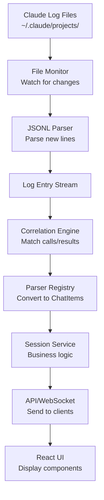

# Comprehensive Implementation Guide: Claude UI
## Complete Domain Specification & Migration Map

## Table of Contents
1. [Current vs New Architecture Mapping](#current-vs-new-architecture-mapping)
2. [Complete Domain Specification](#complete-domain-specification)
3. [Tool Parsers & Chat Items](#tool-parsers--chat-items)
4. [Data Flow & Integration](#data-flow--integration)
5. [File-by-File Migration Guide](#file-by-file-migration-guide)
6. [Implementation Checklist](#implementation-checklist)

---

## 🗺️ Current vs New Architecture Mapping

### **Current Structure → New Structure**

```
CURRENT                                    NEW
-------                                    ---
packages/api-server/                   →   apps/api/
packages/client/                       →   apps/web/
packages/chat-items/*                  →   packages/core/chat-items/
packages/transformer/                  →   packages/log-processor/transformer/
packages/codex-log-monitor/           →   packages/log-processor/monitor/

// Consolidation happening:
15+ chat-item packages                 →   1 chat-items package
Multiple type definitions              →   shared/types/
Scattered utilities                    →   packages/core/utils/
```

---

## 📋 Complete Domain Specification

### **1. Core Domain Entities**

```typescript
// shared/types/entities.ts

// These are from Claude's logs - we don't create them
export interface LogEntry {
  uuid: string;                    // Claude's message ID
  parentUuid?: string;             // Thread parent
  timestamp: string;               // ISO timestamp
  type: 'user' | 'assistant';      // Who sent it
  content: string | MessageContent; // The actual content
  isSidechain?: boolean;           // Side conversations
}

export interface MessageContent {
  type: 'text' | 'tool_use' | 'tool_result';
  text?: string;
  id?: string;                     // tool_use_id for correlation
  name?: string;                   // tool name
  input?: unknown;                 // tool input
  output?: unknown;                // tool result
  is_error?: boolean;
}

// Domain models we create
export interface Session {
  id: string;                      // UUID from filename
  projectPath: string;             // Decoded working directory
  encodedPath: string;             // URL-safe version
  isActive: boolean;               // Updated in last 60s
  lastActivity: Date;
  messageCount: number;
  hasToolUsage: boolean;
  createdAt: Date;
  fileSize: number;
  filePath: string;                // Full path to JSONL file
}

export interface Project {
  path: string;                    // Original path
  encodedPath: string;             // URL-safe
  name: string;                    // Last segment of path
  sessionCount: number;
  hasActiveSessions: boolean;
  lastActivity: Date;
  sessions: Session[];             // All sessions in project
}

export interface ToolInteraction {
  toolUseId: string;
  sessionId: string;
  toolName: string;
  status: 'pending' | 'completed' | 'failed' | 'timeout';
  toolCall: LogEntry;
  toolResult?: LogEntry;
  thinking?: LogEntry[];           // Thinking blocks before/after
  startTime: Date;
  endTime?: Date;
  duration?: number;               // milliseconds
}
```

### **2. Chat Item Types (UI Components)**

```typescript
// packages/core/chat-items/types.ts

// Base type for all chat items
export interface ChatItem {
  id: string;
  type: ChatItemType;
  timestamp: string;
  sessionId: string;
  content: unknown;                // Type varies by tool
}

export type ChatItemType = 
  | 'user_message'
  | 'assistant_message'
  | 'thinking_block'
  | 'bash_tool'
  | 'edit_tool'
  | 'read_tool'
  | 'write_tool'
  | 'glob_tool'
  | 'grep_tool'
  | 'ls_tool'
  | 'multi_edit_tool'
  | 'todo_read_tool'
  | 'todo_write_tool'
  | 'mcp_sequential_thinking'
  | 'mcp_context7'
  | 'mcp_puppeteer';

// Specific tool types
export interface BashToolItem extends ChatItem {
  type: 'bash_tool';
  content: {
    command: string;
    description?: string;
    output?: {
      stdout: string;
      stderr: string;
      exitCode: number;
      isError: boolean;
      interrupted?: boolean;
    };
    status: 'pending' | 'completed' | 'failed';
  };
}

export interface EditToolItem extends ChatItem {
  type: 'edit_tool';
  content: {
    file_path: string;
    old_string: string;
    new_string: string;
    replace_all?: boolean;
    status: 'pending' | 'completed' | 'failed';
    error?: string;
  };
}

// ... etc for each tool type
```

---

## 🔧 Tool Parsers & Chat Items

### **Parser Architecture**

```typescript
// packages/core/chat-items/parsers/index.ts

export interface ToolParser<T extends ChatItem> {
  toolName: string;
  canParse(entry: LogEntry): boolean;
  parse(entry: LogEntry, result?: LogEntry): T;
}

// packages/core/chat-items/parsers/bash-parser.ts

export class BashToolParser implements ToolParser<BashToolItem> {
  toolName = 'bash';
  
  canParse(entry: LogEntry): boolean {
    return entry.type === 'assistant' && 
           this.isToolUse(entry) && 
           entry.content.name === 'bash';
  }
  
  parse(entry: LogEntry, result?: LogEntry): BashToolItem {
    const toolUse = this.extractToolUse(entry);
    const toolResult = result ? this.extractToolResult(result) : undefined;
    
    return {
      id: toolUse.id,
      type: 'bash_tool',
      timestamp: entry.timestamp,
      sessionId: this.extractSessionId(entry),
      content: {
        command: toolUse.input.command,
        description: toolUse.input.description,
        output: toolResult ? {
          stdout: toolResult.output.stdout || '',
          stderr: toolResult.output.stderr || '',
          exitCode: toolResult.output.exit_code || 0,
          isError: toolResult.is_error || false,
          interrupted: toolResult.output.interrupted
        } : undefined,
        status: this.determineStatus(toolUse, toolResult)
      }
    };
  }
  
  private isToolUse(entry: LogEntry): boolean {
    return typeof entry.content === 'object' && 
           entry.content.type === 'tool_use';
  }
  
  private extractToolUse(entry: LogEntry): any {
    // Extract tool_use content block
    if (Array.isArray(entry.content)) {
      return entry.content.find(c => c.type === 'tool_use');
    }
    return entry.content;
  }
  
  private determineStatus(toolUse: any, toolResult?: any): 'pending' | 'completed' | 'failed' {
    if (!toolResult) return 'pending';
    return toolResult.is_error ? 'failed' : 'completed';
  }
}

// packages/core/chat-items/parsers/registry.ts

export class ParserRegistry {
  private parsers = new Map<string, ToolParser<any>>();
  
  constructor() {
    // Register all parsers
    this.register(new BashToolParser());
    this.register(new EditToolParser());
    this.register(new ReadToolParser());
    this.register(new WriteToolParser());
    this.register(new GlobToolParser());
    this.register(new GrepToolParser());
    this.register(new LsToolParser());
    this.register(new MultiEditToolParser());
    this.register(new TodoReadToolParser());
    this.register(new TodoWriteToolParser());
    this.register(new McpSequentialThinkingParser());
    this.register(new McpContext7Parser());
    this.register(new McpPuppeteerParser());
  }
  
  register(parser: ToolParser<any>) {
    this.parsers.set(parser.toolName, parser);
  }
  
  getParser(toolName: string): ToolParser<any> | undefined {
    return this.parsers.get(toolName);
  }
  
  parseEntry(entry: LogEntry, result?: LogEntry): ChatItem | null {
    for (const parser of this.parsers.values()) {
      if (parser.canParse(entry)) {
        return parser.parse(entry, result);
      }
    }
    
    // Default parsers for non-tool messages
    if (entry.type === 'user') {
      return this.parseUserMessage(entry);
    }
    if (entry.type === 'assistant' && this.isTextMessage(entry)) {
      return this.parseAssistantMessage(entry);
    }
    
    return null;
  }
}
```

### **Complete Parser Implementations**

```typescript
// packages/core/chat-items/parsers/edit-parser.ts

export class EditToolParser implements ToolParser<EditToolItem> {
  toolName = 'edit';
  
  canParse(entry: LogEntry): boolean {
    return this.isToolUse(entry, 'edit');
  }
  
  parse(entry: LogEntry, result?: LogEntry): EditToolItem {
    const toolUse = this.extractToolUse(entry);
    const toolResult = result ? this.extractToolResult(result) : undefined;
    
    return {
      id: toolUse.id,
      type: 'edit_tool',
      timestamp: entry.timestamp,
      sessionId: this.extractSessionId(entry),
      content: {
        file_path: toolUse.input.file_path,
        old_string: toolUse.input.old_string,
        new_string: toolUse.input.new_string,
        replace_all: toolUse.input.replace_all || false,
        status: this.determineStatus(toolResult),
        error: toolResult?.is_error ? toolResult.output : undefined
      }
    };
  }
}

// packages/core/chat-items/parsers/read-parser.ts

export class ReadToolParser implements ToolParser<ReadToolItem> {
  toolName = 'read';
  
  parse(entry: LogEntry, result?: LogEntry): ReadToolItem {
    const toolUse = this.extractToolUse(entry);
    const toolResult = result ? this.extractToolResult(result) : undefined;
    
    return {
      id: toolUse.id,
      type: 'read_tool',
      timestamp: entry.timestamp,
      sessionId: this.extractSessionId(entry),
      content: {
        file_path: toolUse.input.file_path,
        limit: toolUse.input.limit,
        offset: toolUse.input.offset,
        file_content: toolResult?.output,
        status: this.determineStatus(toolResult),
        error: toolResult?.is_error ? toolResult.output : undefined
      }
    };
  }
}

// ... Similar implementations for all other tools
```

---

## 🔄 Data Flow & Integration

### **Complete Data Flow**



### **Correlation Engine (Fixed)**

```typescript
// packages/log-processor/transformer/correlation-engine.ts

export class CorrelationEngine {
  private pendingCalls = new Map<string, PendingCorrelation>();
  private readonly CORRELATION_TIMEOUT = 5 * 60 * 1000; // 5 minutes
  
  constructor(
    private parserRegistry: ParserRegistry,
    private eventEmitter: SimpleEventEmitter
  ) {}
  
  async processLogEntry(entry: LogEntry): Promise<ChatItem | null> {
    // Handle tool calls
    if (this.isToolCall(entry)) {
      return this.handleToolCall(entry);
    }
    
    // Handle tool results
    if (this.isToolResult(entry)) {
      return this.handleToolResult(entry);
    }
    
    // Handle thinking blocks
    if (this.isThinkingBlock(entry)) {
      return this.handleThinkingBlock(entry);
    }
    
    // Regular messages
    return this.parserRegistry.parseEntry(entry);
  }
  
  private handleToolCall(entry: LogEntry): ChatItem | null {
    const toolUse = this.extractToolUse(entry);
    const toolName = toolUse.name;
    
    // Create pending correlation
    const pending: PendingCorrelation = {
      toolUseId: toolUse.id,
      toolName: toolName,
      callEntry: entry,
      thinking: [],
      timestamp: new Date()
    };
    
    this.pendingCalls.set(toolUse.id, pending);
    
    // Schedule timeout cleanup
    setTimeout(() => {
      if (this.pendingCalls.has(toolUse.id)) {
        this.handleTimeout(toolUse.id);
      }
    }, this.CORRELATION_TIMEOUT);
    
    // Parse as pending tool
    const parser = this.parserRegistry.getParser(toolName);
    if (parser) {
      return parser.parse(entry);
    }
    
    return null;
  }
  
  private handleToolResult(entry: LogEntry): ChatItem | null {
    const toolResult = this.extractToolResult(entry);
    const toolUseId = toolResult.tool_use_id;
    
    const pending = this.pendingCalls.get(toolUseId);
    if (!pending) {
      console.warn(`Orphaned tool result: ${toolUseId}`);
      return null;
    }
    
    // Complete correlation
    this.pendingCalls.delete(toolUseId);
    
    // Parse with both call and result
    const parser = this.parserRegistry.getParser(pending.toolName);
    if (parser) {
      const chatItem = parser.parse(pending.callEntry, entry);
      
      // Emit completion event
      this.eventEmitter.emit('tool.completed', {
        sessionId: this.extractSessionId(entry),
        toolUseId: toolUseId,
        toolName: pending.toolName,
        duration: Date.now() - pending.timestamp.getTime(),
        success: !toolResult.is_error
      });
      
      return chatItem;
    }
    
    return null;
  }
  
  private handleThinkingBlock(entry: LogEntry): ChatItem {
    // Check if this thinking is associated with a pending tool
    const recentPending = Array.from(this.pendingCalls.values())
      .filter(p => Date.now() - p.timestamp.getTime() < 1000)
      .sort((a, b) => b.timestamp.getTime() - a.timestamp.getTime())[0];
    
    if (recentPending) {
      recentPending.thinking.push(entry);
    }
    
    return {
      id: entry.uuid,
      type: 'thinking_block',
      timestamp: entry.timestamp,
      sessionId: this.extractSessionId(entry),
      content: {
        text: this.extractThinkingText(entry),
        associatedTool: recentPending?.toolName
      }
    };
  }
  
  private handleTimeout(toolUseId: string) {
    const pending = this.pendingCalls.get(toolUseId);
    if (pending) {
      this.pendingCalls.delete(toolUseId);
      
      this.eventEmitter.emit('tool.timeout', {
        toolUseId: toolUseId,
        toolName: pending.toolName,
        timestamp: pending.timestamp
      });
    }
  }
}

interface PendingCorrelation {
  toolUseId: string;
  toolName: string;
  callEntry: LogEntry;
  thinking: LogEntry[];
  timestamp: Date;
}
```

---

## 📁 File-by-File Migration Guide

### **What to Copy Directly (Just Update Imports)**

```typescript
// 1. Path encoding/decoding utilities
// FROM: packages/api-server/src/routes/projects.ts
// TO: packages/core/utils/path-encoding.ts
export function encodePath(path: string): string {
  return '-' + path.slice(1).replace(/\./g, '--').replace(/\//g, '-');
}

export function decodePath(encoded: string): string {
  return '/' + encoded.slice(1).replace(/--/g, '.').replace(/-/g, '/');
}

// 2. Session scanner logic
// FROM: packages/api-server/src/services/session-scanner.ts
// TO: packages/log-processor/scanner/session-scanner.ts
export class SessionScanner {
  // Copy the scanning logic but simplify the class structure
}

// 3. File monitoring
// FROM: packages/codex-log-monitor/src/monitor.ts
// TO: packages/log-processor/monitor/file-monitor.ts
export class FileMonitor {
  // Copy the watch logic, remove complex abstractions
}

// 4. API client
// FROM: packages/client/services/api-client.ts
// TO: apps/web/lib/api-client.ts
export class ApiClient {
  // Keep the same structure, update types
}
```

### **What to Refactor**

```typescript
// 1. Consolidate all chat item types
// FROM: packages/chat-items/*/src/types.ts (15+ files)
// TO: packages/core/chat-items/types.ts
// Merge all interfaces into one file

// 2. Merge all parsers
// FROM: packages/chat-items/*/src/parsers.ts
// TO: packages/core/chat-items/parsers/*.ts
// One parser file per tool, all in same package

// 3. Simplify transformer
// FROM: packages/transformer/src/transformer.ts
// TO: packages/log-processor/transformer/log-transformer.ts
// Remove ToolDiscovery, use ParserRegistry instead

// 4. Update React components
// FROM: packages/client/components/chat-items/*
// TO: apps/web/components/chat-items/*
// Fix imports, remove ui-components references
```

### **What to Create New**

```typescript
// 1. Session repository implementation
// packages/core/session/repository.ts
export interface SessionRepository {
  findById(id: string): Promise<Session | null>;
  findByProject(projectPath: string): Promise<Session[]>;
  findActive(): Promise<Session[]>;
  watchSession(id: string): AsyncIterator<LogEntry>;
}

// 2. Project service
// packages/core/project/service.ts
export class ProjectService {
  async discoverProjects(): Promise<Project[]> {
    // Scan ~/.claude/projects for sessions
    // Group by project path
    // Calculate aggregates
  }
}

// 3. WebSocket handler
// apps/api/src/ws/session-stream.ts
export function createSessionWebSocket(sessionService: SessionService) {
  return {
    open(ws: WSContext) {
      const sessionId = ws.params.sessionId;
      ws.data.stream = sessionService.streamUpdates(sessionId);
    },
    message(ws: WSContext, message: any) {
      // Handle client messages
    },
    close(ws: WSContext) {
      // Cleanup
    }
  };
}

// 4. React Query hooks
// apps/web/hooks/use-sessions.ts
export function useSessions(projectPath?: string) {
  return useQuery({
    queryKey: ['sessions', projectPath],
    queryFn: () => apiClient.getSessions({ projectPath }),
    staleTime: 30_000
  });
}

export function useSessionStream(sessionId: string) {
  const [messages, setMessages] = useState<ChatItem[]>([]);
  
  useEffect(() => {
    const ws = new WebSocket(`ws://localhost:3001/sessions/${sessionId}/stream`);
    
    ws.onmessage = (event) => {
      const chatItem = JSON.parse(event.data);
      setMessages(prev => [...prev, chatItem]);
    };
    
    return () => ws.close();
  }, [sessionId]);
  
  return messages;
}
```

---

## ✅ Implementation Checklist

### **Phase 1: Core Setup (Days 1-3)**
- [ ] Create new project structure
- [ ] Set up TypeScript config
- [ ] Install dependencies (Next.js, Elysia, etc)
- [ ] Copy shared types from current project
- [ ] Set up monorepo with Turborepo

### **Phase 2: Domain Layer (Days 4-6)**
- [ ] Implement Session entity
- [ ] Implement Project entity  
- [ ] Create value objects (ProjectPath, etc)
- [ ] Set up repository interfaces
- [ ] Copy & adapt path encoding utils

### **Phase 3: Log Processing (Days 7-9)**
- [ ] Port FileMonitor from current project
- [ ] Port JSONL parser
- [ ] Implement all tool parsers (14 total)
- [ ] Create ParserRegistry
- [ ] Implement CorrelationEngine with fixes

### **Phase 4: Services (Days 10-12)**
- [ ] Create SessionService
- [ ] Create ProjectService
- [ ] Implement FileSessionRepository
- [ ] Add SessionScanner logic
- [ ] Create event emitter

### **Phase 5: API Layer (Days 13-15)**
- [ ] Set up Elysia server
- [ ] Create session routes
- [ ] Create project routes
- [ ] Implement WebSocket endpoint
- [ ] Add error handling middleware

### **Phase 6: Frontend (Days 16-18)**
- [ ] Create Next.js app structure
- [ ] Port layout components
- [ ] Create chat item components
- [ ] Implement React Query hooks
- [ ] Add WebSocket client

### **Phase 7: Integration (Days 19-21)**
- [ ] Connect frontend to API
- [ ] Test real-time updates
- [ ] Add error boundaries
- [ ] Performance optimization
- [ ] Documentation

---

## 🗂️ Complete File Structure

```
claude-ui/
├── apps/
│   ├── web/
│   │   ├── app/
│   │   │   ├── layout.tsx
│   │   │   ├── page.tsx
│   │   │   └── sessions/
│   │   │       └── [sessionId]/
│   │   │           └── page.tsx
│   │   ├── components/
│   │   │   ├── chat-items/
│   │   │   │   ├── bash-tool.tsx
│   │   │   │   ├── edit-tool.tsx
│   │   │   │   ├── read-tool.tsx
│   │   │   │   └── ... (all 14 tools)
│   │   │   └── layout/
│   │   │       ├── navbar.tsx
│   │   │       └── sidebar.tsx
│   │   ├── hooks/
│   │   │   ├── use-sessions.ts
│   │   │   ├── use-projects.ts
│   │   │   └── use-session-stream.ts
│   │   └── lib/
│   │       └── api-client.ts
│   │
│   └── api/
│       ├── src/
│       │   ├── index.ts
│       │   ├── routes/
│       │   │   ├── sessions.ts
│       │   │   ├── projects.ts
│       │   │   └── health.ts
│       │   ├── services/
│       │   │   ├── session-service.ts
│       │   │   └── project-service.ts
│       │   └── ws/
│       │       └── session-stream.ts
│       └── package.json
│
├── packages/
│   ├── core/
│   │   ├── session/
│   │   │   ├── models.ts
│   │   │   ├── repository.ts
│   │   │   └── index.ts
│   │   ├── project/
│   │   │   ├── models.ts
│   │   │   ├── service.ts
│   │   │   └── index.ts
│   │   ├── chat-items/
│   │   │   ├── types.ts
│   │   │   ├── parsers/
│   │   │   │   ├── bash-parser.ts
│   │   │   │   ├── edit-parser.ts
│   │   │   │   ├── read-parser.ts
│   │   │   │   └── ... (all 14 parsers)
│   │   │   ├── registry.ts
│   │   │   └── index.ts
│   │   ├── utils/
│   │   │   ├── path-encoding.ts
│   │   │   └── date-utils.ts
│   │   └── events/
│   │       └── emitter.ts
│   │
│   └── log-processor/
│       ├── monitor/
│       │   ├── file-monitor.ts
│       │   └── index.ts
│       ├── scanner/
│       │   ├── session-scanner.ts
│       │   └── index.ts
│       ├── parser/
│       │   ├── jsonl-parser.ts
│       │   └── index.ts
│       └── transformer/
│           ├── correlation-engine.ts
│           ├── log-transformer.ts
│           └── index.ts
│
└── shared/
    └── types/
        ├── entities.ts
        ├── api.ts
        └── ws.ts
```

This is a complete specification. Every parser, every service, every integration point is accounted for. You can now implement this systematically.